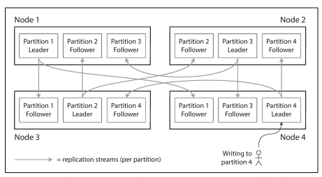

## 개요

앞서 5장에서 다룬 복제는 동일한 데이터의 복사본 여러개를 다른 노드에 저장하는 개념이였다 그러나 데이터 셋이 매우 크거나 질의 처리량이 매우 높다면 복제 만으로 부족하고 데이터셋을 파티션으로 쪼개 필요가 있다 이작업을 샤딩 이라고 한다.
파티셔닝 : 대용량데이터 베이스를 의도적으로 작은 단위로 쪼개는 방법

보통 파티셔닝을 복제와 함께 적용해 각 파티션의 복사본을 여러 노드에 저장한다.
리더 팔로워 복제 모델을 사용한다면 파티셔닝과 복제의 조합은 아래 그림과 같은 형태가 된다. 각 파티션 리더는 하나의 노드에 할당되고 팔로워들은 다른 노드에 할당된다. 각 노드는 어떤 파티션에게는 리더이면서 다른 파티션에게는 팔로워가 될 수 있다.

이번 장에서는 1) 대용량 데이터셋을 파티셔닝하는 몇가지 방법 2) 데이터 색인과 파티셔닝의 상호작용 3) 클러스터에 노드 추가 및 제거시 필요한 재균형화 4) 데이터베이스가 어떻게 요청을 올바른 파티션에 전달하고 질의를 실행하는지
위 4가지를 개략적으로 공부한다.

## 키-값 데이터 파티셔닝

대용량의 데이터를 파티셔닝 할 때 어떤 레코드를 어느 노드에 저장할지 어떻게 결정해야 할까? 파티셔닝의 목적은 데이터와 질의 부하를 노드 사이에 고르게 분산시키는 것이다. 근데 파티셔닝이 고르게 이루어지지 않아 다른 파티션보다 데이터가 많거나 질의를 많이 받는 파티션이 있다면 쏠렸다(skewed)라고 말한다. 이런 불균형하게 부하가 높은 파티션을 핫스팟이라고 한다.

핫스팟을 회피하는 가장단순한 방법은 레코드를 할당할 노드를 무작위로 선택하는 것이다. 그러면 데이터가 노드들 사이에 매우 고르게 분산되지만 읽기 작업시 해당 레코드가 어느 노드에 저장됐는지 알 수 없으므로 모든 노드에 병렬질의를 실행해야 한다는 단점이 있다.

더 좋은 방법은 키-값데이터 모델을 사용하는 것이다. 이 모델에서는 항상 기본키를 통해 레코드에 접근한다. 키는 언제나 정렬되어 있기에 원하는 값을 빨리 찾을 수 있다.

### 키 범위 기준 파티셔닝

파티셔닝하는 방법 중 하나는 백과 사전 처럼 각 파티션에 연속된 범위의 키를 할당하는 것이다. 각 범위들 사이의 경계를 알면 어떤 키가 어느 파티션에 속하는지
쉽게 찾을 수 있다. 또 어떤 파티션이 어느 노드에 할당 됐는지 알면 적절한 노드로 요청을 직접 보 낼 수 있다.

데이터가 고르게 분포하지 않을 수도 있기 때문에 키 범위가 반드 시 동일 할 필요는 없다. 데이터를 고르게 분산시키려면 파티션 경계를 데이터에 맞춰 조정해야 한다.
파티션 경계는 관리자가 수ㅈ동으로 선택하거나 데이터 베이스에서 자동으로 선택되게 할 수있다.

각 파티션내에서는 키를 정렬 된 순서로 저장 할 수있다.(SS Table, LSM Tree)
키 범위 기준 파티셔닝은 특정한 접근 패턴이 핫스팟을 유발 할 수 있다는 단점이 있다.
만약 타임스태프가 키라면 파티션은 시간 범위에 대응되서 센서 데이터 베이스 같은 경우는 데이터 쏠림의 현상이 나타날 수 있다. 해당 문제를 회피하려면 키의 첫번째요소로 타임스태프가 아닌 다른것을 사용해야한다. 이를 테며 타임 스탬프 앞에 센서 이름을 붙여서 파티셔닝시 센서이름을 먼저 사용한 후 시간을 사용하게 할 수 있다. 그러나 이 경우는 만약 동일한 시간대의 여러 센서 값을 얻으려 할때 각 센서 이름 마다 별개의 범위 질의가 필요해진다.

### 키의 해시값 기준 파티셔닝

좋은 해시 함수는 쏠린 데이터를 입력으로 받아 균일하게 분산되게 한다.
키에 적합한 해시 함수를 구했다면 각 파티션에 (키 범위대신) 해시값 범위를 할당하고
해시값이 파티션의 범위에 속하는 모든 키를 그 파티션에 할당 하면 된다.
이 기법은 키를 파티션 사이에 균일하게 분산시키는 데 조ㅎ다.
그러나 이 기법을 사용하면 범위 질의를 효율적으로 실행 할 수 있는 능력을 잃어버린다.
인접했던 키들이 모든 파티션에 흩어져서 정렬순서가 유지 되지 않는다.

### 쏠림 작업 부하와 핫스팟 완화

앞서 말한대로 키를 해싱해서 파티션을 정하면 핫스팟을 줄이 는데 도움이 된다 하지만 핫스팟을 완벽히 제거 할 수는 없다. 항상 동일한 키를 읽고 쓰는 극단적인 상황에서는 모든 요청이 동일한 파티션으로 쏠리게 된다.

유명인 예시가 그런 경우이다. 소셜미디어 사이트에서 수백만명의 팔로워를 거느린 유명인이 뭔가를 하게 되면 후폭풍이 발생할 수 있다. 동일한 키에 대한 엄청난 엑세스는 현대 데이터 시스템이 해결할 방법이 없다. 애플리케이션에서 쏠림을 완화해야 한다.
예를 들어 키의 시작이나 끝네 임의의 숫자 10진수 두개를 붙여서 100개의 다른 키로 분산시키는 등의 방법이나 그러나 이 방법도 읽기를 수행할 때 추가 작업이 필요하므로 트레이드 오프가 있는 작업이다.

## 파티셔닝과 보조 색인

파티셔닝은 키-값 데이터 모델에 의존한다. 그러나 보조 색인이 연관되면 상황은 복잡해진다. 보조 색인은 보통 레코드를 유일하게 식별하는 용도가
아니라 특정한 값이 발생한 항목을 검색하는 수단이이다.
보조 색인 은 파티션에 깔끔하게 대응되지 않는 문제가 있다, 보조 색인이 있는 데이터 베이스를 파티셔닝하는 데 널리 쓰이는 두가지 방법이 있다.
문서 기반 파티셔닝과 용어 기반 파티셔닝 이다.

### 문서 기준 보조색인 파티셔닝

각 파티션은 자신의 보조 색인을 유지하며 그 파티션에 속하는 문서만 담당한다.
다른 파티션에 어떤 데이터가 저장되는지는 신경쓰지 않는다.
데아터베이스에 쓰기 작업을 실행할때는 쓰려고 하는 문서 id 를 포함하는 파티션만 다루면 된다 .

그러나 문서 ㄱ기준으로 파티션이 된 색읜을 써서 읽을 때는 주의를 기울여야 한다/
특별한 작업을 하지 않으면 특정 조건의 데이터가 동일한 파티션에 있다고 보장할 수 없으니 모든 파티셔능로 질의를 보내서 얻은 결과를 모두 모아야한다. 이런식의 질의 를 보내는 방법을 스캐터/개더(scatter/gather)라고 하는데 보조 색인을 써서 읽는 질의는 큰 비용이 들 수 있다.

### 용어 기준 보조색인 파티셔닝

모든 파티션의 데이터를 담당하는 전역색인 쓰기 느리다
