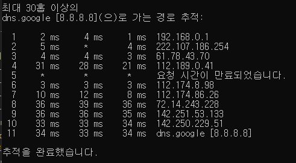

:::tip GOAL
Q. 네트워크란? 인터넷이란?  
Q. 네트워크를 크기에 따라, 연결 형태에 따라 분류하면?    
Q. 네트워크에서 데이터는 어떻게 주고 받는가?  
Q. 네트워크 프로토콜이란?  
:::

## 네트워크란 무엇인가

- 네트워크란?  
  노드들이 데이터를 공유할 수 있게 하는 디지털 전기통신망의 하나이다.
  즉 분산되어 있는 컴퓨터를 통신망으로 연결한 것을 말한다.
  네트워크에서 여러 장치들은 노드 간 연결을 사용하여 서로에게 데이터를 교환한다.

  노드 : 네트워크에 속한 컴퓨터 또는 통신장비를 뜻하는 말

- 인터넷이란?  
  문서, 그림 영상과 같은 여러가지 데이터를 공유하도록 구성된 **세상에서 가장 큰 전세계를 연결하는 네트워크**이다. www가 인터넷이 라고 착각하는 경우가 종종 있지만 www는 인터넷이 아니라 인터넷의 서비스 중 하나이다. 인터넷을 통해 웹과 관련된 데이터를 공유하는 서비스이다

## 네트워크의 분류

- 네트워크를 크기에 따라 분류하면

  LAN(Local Area Network) WAN(Wide Area NetWork), MAN(Metropolitan Area Network), 그 외 기타 VLAN, CAN, PAN 등등으로 분류 할 수 있다.  
  **LAN**: 가까운 지역을 하나로 묶은 네트워크이며, 같은 네트워크 대역으로 집의 LAN, 회사의 LAN, 학교의 LAN 등이 있다.  
  **WAN**: 멀리 있는 지역을 한데 묶은 네트워크로, 여러개의 LAN네트워크 대역이 서로 연결되어져 있는 것이다.

- 네트워크를 연결 형태에 따라 분류하면

  **Star형**: 중앙 장비에 모든 노드가 연결되어 있다  
  **Mash형**: 여러 노드들이 서로 그물처럼 연결되어 있다  
  **Tree형**: 마치 나무의 가지처럼 계층구조로 연결되어 있다  
  그 외 기타: 링형, 버스형, 혼합형

  Star형의 예시로는 일반적으로 가정집에서는 공유기를 통해서 핸드폰, 컴퓨터, TV 등등이 연결되는 경우를 들 수 있다 star형의 문제점은 공유기가 고장나면 집안의 모든 네트워크가 끊겨 버린다. 보통 LAN대역 네트워크 연결시킬 떄 star형으로 많이 만든다.

  Mesh형의 경우는 여러 노드들이 그물처럼 엮여 있기 때문에 하나의 노드에서 에러가 난다고 모든 노드에 영향을 미치지는 않는다. 실제 우리나라가 다른 나라와 연결되어 있는 형태도 Mash형이다.

  실제 인터넷은 여러 형태를 혼합한 형태인 혼합형이다.

## 네트워크의 통신 방식

- 유니 캐스트: 특정 대상이랑만 1:1로 통신하는 통신방식

- 멀티 캐스트: 특정 다수와 1:N으로 통신하는 통신방식

- 브로드 캐스트: 네트워크에 있는 모든 대상과 통신하는 통신방식

## 네트워크 프로토콜

* 프로토콜이란?  
프로토콜은 일종의 약속, 양식이다.  
네트워크에서 노드와 노드가 통신할 때어떤 노드가 어느 노드에게 어떤 데이터를 어떻게 보내는지 작성하기 위한 양식을 프로토콜이라 한다. 각 프로토콜들은 해당 프로토콜만의 양식이 있다.  
네트워크도 사용자가 하고 싶은 네트워크 통신 상황에 따라서 그 상황에 맞는 프로토콜이 있다.

* 프로토콜 예시  
같은 네트워크 대역에서 통신할 때 : Ethernet 프로토콜(MAC 주소사용)  
외부 네트워크와 통신할 때 : ICMP, IPv4, ARP(IP 주소사용)  
여러가지 특정 프로그램으로 통신할 때 : TCP, UDP(포트 번호사용)  

**각 프로토콜에 대한 상세한 내용은 뒤에서 공부한다**

## 실습

1. 구글과 나는 어떻게 연결되어 있는지 확인해보기

```
cmd 창에서 `tracert 8.8.8.8`명령어로 확인
  tracert: trace 라우트 라는 하나의 프로그램
  8.8.8.8 :구글 DNS서버의 IP주소
```



  **결과**
  * 내 컴퓨터와 구글DNS서버와 통신을 하려고 할 때, 목적지까지 가기 위해 거쳐간 네트워크 LAN대역들을 확인 할 수 있다.    
  * 요청시간이 만료되었습니다.(IP안나옴) : IP주소를 공개 안한 곳으로 방화벽 같은 것으로 막아놓은 곳 이다. 대신 통신은 가능하게 해두었다.  
  * 구글 까지 찾아갈 때 11개의 대역 거쳐갔다. 보통 15개 이내이다.
  * 이런식으로 멀리 떨어져있는 서버라고 하더라도 결국엔 여러개의 네트워크 대역들로 연결되어있어서 찾아 갈 수 있고 이런 대역들 연결해놓은게 WAN 인터넷이다.   

2. Wireshark 설치: 프로토콜이 어떻게 생겼는지 직접 보기 위해 사용할 프로그램을 설치  
Wireshark : 프로토콜 캡쳐해서 볼 수 있게 해주는 프로그램.    

3. 프로토콜 직접 확인해보기 : 설치한 Wireshark를 이용해서 현재 컴퓨터에서 인터넷을 통해 주고받고 있는 내용을 직접 확인해보기    
  
**결과**   
HTTP 프로토콜로 웹서버에서 페이지를 받아왔다. IPv4 프로토콜로 외부 서버에서 받아왔다.
Ethernet 프로토콜로 내부 네트워크 대역의 컴퓨터들 중에서 특정 컴퓨터를 찾아왔다. 인터넷할때 크롬이라는 프로그램이 네이버에 있는 프로그램(웹서버)랑 연결이 되야하기 때문에 TCP프로토콜 사용했다.
프로토콜은 이렇게 용도에 맞게 여러개 프로토콜들이 같이 사용되고, 이런모습을 인캡슐레이션이라고 한다.


이제 프로토콜에 대한 상세한 내용을 공부 해보자!:fire::fire::fire::fire:

## Reference
[따라하며 배우는 IT - 네트워크 기초(YouTube)](https://www.youtube.com/playlist?list=PL0d8NnikouEWcF1jJueLdjRIC4HsUlULi)
