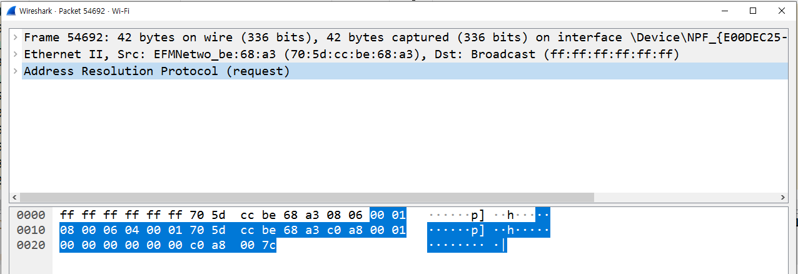

:::tip GOAL
Q. TCP/IP모델과 OSI 7계층 모델이란?   
Q. 위 두모델의 공통점과 차이점은?  
Q. 패킷이란? 패킷을 이용한 통신과정은?  
Q. 네트워크 프로토콜이란?  
:::
해당페이지는 2022년 3월 노션에서 마이그레이션 되었습니다.  

## TCP/IP 모델

1960년대 말 미국방성의 연구에서 시작되어 1980년대 초 프로토콜 모델로 공개
현재의 인터넷에서 컴퓨터들이 서로 정보를 주고받는데 쓰이는 통신 규약(프로토콜)의 모음이다.

4계층: 응용  
3계층: 전송  
2계층: 네트워크  
1계층: 네트워크 인터페이스

## OSI 7계층

1984년 네트워크 통신을 체계적으로 다루는 ISO에서 표준으로 지정한 모델  
데이터를 주고받을 때 데이터 자체의 흐름을 각 구간별로 나눠 놓은 것

7계층 응용 : **HTTP**, SMTP, IMAP, POP, SNMP, FTP, TELNET, SSH  
6계층 표현 : SMB, AFP, XDR  
5계층 세션 : NetBIOS  
4계층 전송 : **TCP**, **UDP**, SPX  
3계층 네트워크 : **IP**, **ICMP**, IGMP, X.25, CLNP, **ARP**, RARP, BGP, OSPF, RIP, IPX, DDP  
2계층 데이터 링크 : **이더넷**, 토큰링, PPP, HDLC, 프레임 릴레이, ISDN, ATM, 무선랜, FDDI  
1계층 물리 : 전선, 전파, 광섬유, 동축케이블, 도파관, PSTN, 리피터, DSU, CSU, 모뎀

\*디테일하게는 굵은 글씨 프로토콜 정도만 알아도 된다.

## 두 모델의 공통점과 차이점

실제 네트워크는 TCP/IP모델에 더 맞는다.

- 공통점
  - 네트워크를 계층으로 나눠서 분류했다.
  - 계층간 역할 정의하고 사용하는 모델이다.
- 차이점  
  - 계층의 수 차이
  - OSI는 통신을 역할을 기반으로 분류했다.(논리적인 느낌)
  - TCP/IP는 네트워크를 통해서 데이터를 전달 할 때,프로토콜 기반으로 기술 자체를 분류했다.(실무적인 느낌)
    예를 들어 http라는 프로토콜은 OSI게층에서 5,6,7계층의 역할을 다 가지고 있어서 분류하기 애매하다.
  - OSI는 통신 전반에 대한 표준
  - TCP/IP는 데이터 전송기술 특화

## 패킷, 네트워크를 통해 전달되는 데이터

- 패킷이란?  
  패킷이란 네트워크 상에서 전달되는 데이터를 통칭하는 말로 네트워크에서 전달하는
  데이터의 형식화된 블록이다. 패킷은 제어 정보와 사용자 데이터로 이루어지며 사용자 데이터는 페이로드라고도 한다.
  여러 번 포장된 택배 상자처럼 패킷은 패킷을 감싸고 있다.(여러 프로토콜들로 캡슐화 되어있다.)

* 캡슐화(인캡슐레이션)  
  여러 프로토콜을 이용해서 최종적으로 보낼 때 패킷을 만드는 과정
  높은 계층에서 낮은 계층으로 인캡슐레이션 된다.
  `데이터` -> `TCP + 페이로드(데이터)` -> `IPv4 + 페이로드(TCP + 데이터)` -> `Ethernet + 페이로드(IPv4 + TCP + 데이터)`

* 디캡슐화(디캡슐레이션)  
  낮은계층에서 높은계층으로 디캡슐레이션 한다.
  패킷을 받았을 때 프로토콜들을 하나씩 확인하면서 데이터를 확인하는 과정
  `Ethernet + 페이로드(IPv4 + TCP + 데이터)` -> `IPv4 + 페이로드(TCP + 데이터)`-> `TCP + 페이로드(데이터)`-> `데이터`

* PDU(Protocol Data Unit)  
  계층별로 패킷들을 부르는 이름이 다르다.   
  4계층까지 합쳤을 때 PDU = 세그먼트 ex)TCP + 페이로드(데이터)  
  3계층까지 합쳤을 때 PDU = 패킷 ex)IPv4 + 페이로드(TCP + 데이터)  
  2계층까지 합쳤을 때 PDU = 프레임 ex)Ethernet + 페이로드(IPv4 + TCP + 데이터)  
  그러나 일반적으로 패킷이라 말하면 3계층PDU의 패킷이 아니라 네트워크상에서 전달되는 데이터 자체를 패킷이라고 부른다.
  그러나 프레임이라고 얘기하면 2계층까지 인캡슐레이션된 상태이다.  

## 실습

1. 프로토콜의 캡슐화 된 모습과 계층별 프로토콜들을 확인해보기
   : wireshark를 이용하여 패킷을 캡쳐해보고 해당 패킷이 어떻게 캡슐화 되었는지 자세히 살펴본다.

**결과** : 위사진을 보면 이더넷(Ethernet)입장에서는 이더넷 프로토콜이 헤더고 ARP프로토콜이 페이로드이다.
 ARP프로토콜은 3계층이고 헤더로써 2계층이 붙은 것이다. 인캡슐레이션 되었다. ARP입장에서 보면 ARP프로토콜이 헤더고 페이로드는 없다.

## Reference
[따라하며 배우는 IT - 네트워크 기초(YouTube)](https://www.youtube.com/playlist?list=PL0d8NnikouEWcF1jJueLdjRIC4HsUlULi)
