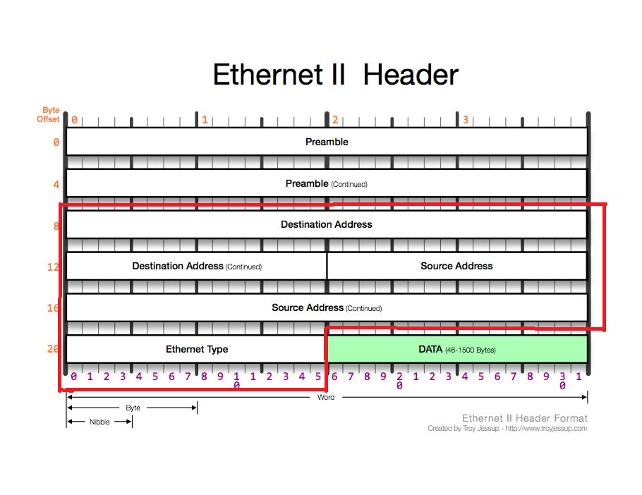

:::tip
Q. 2계층의 기능과 2계층의 네트워크 크기는?
Q. MAC주소란?
Q. Ethernet 프로토콜은?
:::

## 2계층에서 하는 일

- 2계층의 기능
  2계층은 하나의 네트워크 대역 즉, 같은 네트워크 상에
  존재하는 여러 장비들 중에서어떤 장비가 어떤 장비에게보내는 데이터를 전달
  대표적인 장비 스위치
  추가적으로 오류제어, 흐름제어 수행

- 2계층의 네트워크 크기
  2계층은 하나의 네트워크 대역 LAN에서만 통신할 때 사용한다. 다른 네트워크와 통신할 때는
  항상 3계층이 도와주어야 한다. 3계층의 주소와 3계층의 프로토콜을 이용하여야만 다른 네트워크와 통신이 가능하다

## 2계층에서 사용하는 주소

MAC 주소: LAN에서 통신할 때 사용하는 주소, 물리적인 장비가 부여받은 주소이기 때문에 물리적인 주소라고도 부른다.
OUI와 고유번호로 이루어져있다. 6Byte

OUI : IEEE에서 부여하는 일종의 제조회사 식별 ID
고유번호 : 제조사에서 부여한 고유번호

## 2계층 프로토콜

- LAN에서 통신할 때 사용하는 Ethernet 프로토콜
  
  **선이 그어져있는 부분만 중점적으로 보면된다. 14Byte**
  DATA : Ethernet 프로토콜 입장에서 페이로드.
  Destination Address: 목적지 MAC 주소 6Byte
  Source Address: 출발지 MAC 주소 6Byte
  Ethernet Type: 데이터(페이로드)안에 상위 프로토콜(3계층) 내용이 있을 텐데 상위 프로토콜에 어떤 프로토콜이 있는지 미리 알려주는 것 2Byte
  IPv4가 오면 0 8 0 0 ARP 가오면 0 8 0 6이 온다.

## 실습

1. 내 pc의 MAC주소 확인해보기
   cmd 창을 켜서 `ipconfig /all`을 치면 확인가능하다.
   
   `ipconfig /all`

2. Ethernet 프로토콜 캡쳐 하고 분석
   
   내가 같은 네트워크 대역의 다른 IP로 ping요청을 보내서 상대방 IP에서 나에게 보낸 패킷
   앞의 6Byte는 목적지 MAC 주소(나의 MAC주소) 그 다음 6Byte는 상대방의 MAC주소
   마지막 2Byte 상위프로토콜 타입 0800이면 IPv4이다.
   이렇게 Ethernet 프로토콜은 총 14Byte이다.
