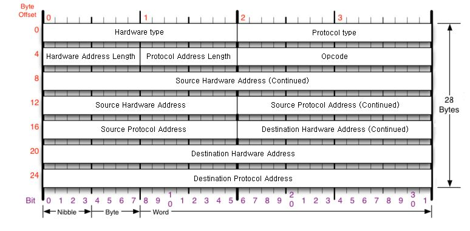

:::tip
Q. 3계층에서 하는 일, 주소, 프로토콜은 무엇인가?
Q. Classful, Classless은?
Q. 사설IP와 공인IP란?
Q. 0.0.0.0, 127.X.X.X 가 나타내는 IP는?
:::

## 3계층의 기능

- 3계층에서 하는 일
  3계층은 LAN과 LAN을 연결시켜주는 역할을 맡는다. 대표적인 장비 라우터
  다른 네트워크 대역 즉, 멀리 떨어진 곳에 존재하는 네트워크까지 어떻게 데이터를 전달할지 제어하는 일을 담당
  발신에서 착신까지의 패킷의 경로를 제어
- 3계층에서 쓰는 주소
  IP주소 : WAN에서 통신할 때 사용하는 주소

  cmd 창에서 ipconfig를 치면 아래 확인 가능
  
  IPv4 주소 : 현재 PC에 할당된 IP주소
  서브넷 마스크 : IP 주소에 대한 네트워크의 대역을 규정하는 것
  게이트웨이 주소 : 외부와 통신할 때 사용하는 네트워크의 출입구

  - 멀리있는곳과 통신하기 위한 최소한의 설정 + DNS서버로 IP를 도메인으로 변경

## 3계층 프로토콜

ARP 프로토콜: IP주소를 이용해 MAC주소를 알아오는 프로토콜

IPv4 프로토콜: WAN에서 통신할 때 사용하는

ICMP 프로토콜: 서로가 통신되는지 확인할 때 사용하는

## 일반적인 IP 주소

일반적인 IP 주소는 IPv4를 말한다.

- Classful IP 주소

  - IPv4 처음 나왔을 때 사용하던 방법
  - IP주소의 범위를(0.0.0.0 ~ 255.255.255.255)를 각각 클래스 별로 나눠서 클래스에 맞게 사용하던 방법
    | 클래스 | 네트워크 구분|시작주소 | 마지막 주소 |
    | ---| --- | --| -- |
    | A클래스 | 0XXXXXXX 첫번째 필드 | 0.0.0.0 | 127.255.255.255 |
    | B클래스 | 10XXXXXX 두번째 필드 | 128.0.0.0 | 191.255.255.255 |
    | C클래스 | 110XXXXX 두번째 필드 | 192.0.0.0 | 223.255.255.255 |
    | D클래스 | 1110XXXX 두번째 필드 | 224.0.0.0 | 239.255.255.255 |
    | E클래스 | 1111XXXX 두번째 필드 | 140.0.0.0 | 255.255.255.255 |

    - A 클래스 0 0000000 00000000 00000000 00000000 ~ 0 1111111 11111111 111111111 111111111
    - B 클래스 10 000000 00000000 00000000 00000000 ~ 10 111111 11111111 111111111 111111111

  - A클래스는 클래스 대역의 첫번째 숫자로만 네트워크대역 구분 A클래스는 0~ 127 까지니까 총 128까지 가질 수 있다. 해당 대역안에 2^24개의 IP주소를 가질 수 있다.
  - B클래스는 클래스 대역의 두번째 숫자까지 네트워크대역 구분 A클래스는 128.0~191.255 까지. 해당 대역안에 2^16개의 IP주소를 가질 수 있다.
  - 이렇게 클래스에 맞게 사용하니 낭비가 심했었다. IP주소가 부족해졌다. -> 구지 클래스에 맞게 쓰지 말고 classless하게 사용하자. 한개의 큰 네트워크를 작게 쪼개서 쓰자.

- Classless IP 주소

  - 서브넷 마스크

    - 클래스풀한 네트워크 대역을 나눠주는데 사용하는 값
    - 어디까지가 네트워크 대역을 구분하는데 사용하고 어디서 부터 호스트를 구분하는데 사용하는지 지정
    - 2진수로 표현했을 때 1 로시작 1과 1사이에 0이 끼여있수 없다. 1과 0이 바뀌는 지역이 구분점
      255.255.255.192 -> 11111111 11111111 11111111 11000000
      위 네트워크 대역에 들어갈 수 있는 컴퓨터의 수는 2^6 =>64대 낭비되는 IP가 많이 줄어든다. C클래스 였다면 2^8 => 256

- 사설 IP와 공인 IP

  - 공인 IP실제 인터넷과 통신할 때 사용하는 IP 주소
  - 사설 IP 사설IP 대역끼리 통신할 때 사용하는 IP 주소
  - 실제 인터넷 세상에서는 공인 IP로만 통신외부 네트워크 대역에서는 사설IP 대역이 보이지 않는다.
  - 공유기가 처리를 해준다. 하나의 요청이 공유기를 통해 나갈때 nat table에다가 요청을 기록 그리고 응답이 오면 해당테이블 보고 대상에게 전달.
  - 일반적으로는 나갔다가 들어오는 것만 처리되지 외부에서 들어오는건 처리가 안된다. 포트포워딩설정 통해서 외부에서 내부로 들어올 수 있게 가능하게 만들 수 있다.
  - 사설 IP와 공인 IP공인IP 1개당 2^32개의 사설IP

## 특수한 IP 주소

- 0.0.0.0 : Wildcard, 나머지 모든 IP(그냥 모든 IP x!)
- 127.0.0.1 : 나 자신을 나타내는 주소(127.0.0.1가 아니더라도 127 ~ 로시작하는 IP)
- 게이트웨이 주소 : 일반적으로 공유기의 IP를 쓴다. 보통 네트워크에서 쓸 수 있는 가장 낮은(혹은 가장 높은) IP를 쓰기로 약속. 외부 네트워크로 가려면 일단 여기로 와야된다. 외부 통신할때 기본의 문은 여기다!
  IP주소, 서브넷마스크는 나를 구분하기 위해서 게이트웨이 주소는 외부IP와의 통신위해서. 이 3개가 설정이 되야 인터넷이 된다!!!(+DNS)

## 실습

1. 내 PC의 IP주소 확인해보기
   cmd에서 `ipcinfig` => 내 컴퓨터의 IP
2. 네이버가 알고 있는 내 IP주소
   검색창에 IP주소 치면 나온다. => 내가 사용하는 네트워크 대역의 공인 IP
