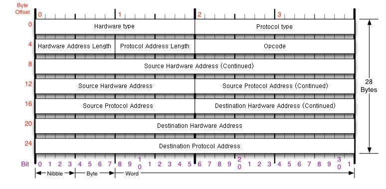

:::tip
Q. IPv4가 하는 일과 IPv4 프로토콜의 구조
Q. ICMP가 하는 일과 ICMP 프로토콜의 구조
Q. 내가 보낸 패킷은 어디로 가는가?
Q. 다른 네트워크까지 내 패킷의 이동과정
Q. 조각화란? 조각화하는 과정
:::

## IPv4 프로토콜

- IPv4가 하는 일
  네트워크 상에서 데이터를 교환하기 위한 프로토콜
  **데이터가 정확하게 전달된느 것을 보장하지 않는다.**
  중복된 패킷을 전달하거나 패킷의 순서를 잘못 전달할 가능성도 있다.
  (악의적으로 이용시 DOS공격이 됨)
  데이터의 정확하고 순차적인 전달은 그보다 상위 프로토콜인 TCP에서 보장한다.
  데이터가 누락될 수 도 있다. 다른계층(4계층)에서 보장을 해준다. 신뢰성 있는 통신은 4계층..
  단지 멀리 보내는 역할만!
- IPv4 프로토콜 구조

Version : IP프로토콜의 버전 무조건 4가 온다. (4Bite?? 0.5Byte) . IPv6은 구조 자체가 다르다 6쓴다고 6아님
IHL(IP Header Length): 해더 가능 범위 20~60 해더길이 20인데? 4비트 최대 15까지 밖에 표현 못함 /4를 해서 표현한다 20-60/ 4 -=> 5-15 로 옵션하나 붙을 때마다 1씩 늘어나는것. 일반적으로는 옵션 안붙으니까 5 가온다
(4Bite?? 0.5Byte)
Type Of Service(TOS): 옛날에 쓰이던 것 0으로 채운다. (1Byte)
Total Length: 헤더 길이 뿐아니라 뒤에 페이로드 까지 합친 전체길이.(2Byte)
Identification : Identification,IP Flags ,Fragment Offset은 하나의 세트라고 보자.
데이터가 큰 걸 보낼 때 잘게 쪼개서 보내야 할때 사용하는 값 쪼개진 값들 알아 볼수 있게.
하나의 데이터가 쪼개 졌을 때 원래 데이터를 알아 볼 수있게 똑같이 주는 ID값. 다시 합칠때쓴다.(2Byte)
IP Flags : 3비트! [x D M] 첫번째는 안쓰고 두번째는 Done Fragmentain More Fragm..?
두번째는 패킷 보내는 사람이 데이터를 안쪼개서 보내겠다
만약 최대 100MB인데 내가 700보낼꺼야 근데 안쪼갤꺼야!!! -> 근데 안보내짐
`ping xxx.xxx.xx -I 7000 -f` 해보면 손실 100%남 최대가 1500이라 즉 잘 안쓴다.
결국 쓰는건 M 조각화가 일어났는데 나말고 다른 패킷 더 있다. 알려주는거 최대 데이터 보다 큰거 전송하면 셋팅 된다
최대보다 큰거 보내면 1 작은거 보내면 0으로 셋팅

Fragment Offset: 13비트 쪼갠데이터 원래순서 있는데 받을 때는 순서 섞일수 있다. 받는 순서대로 조립하면 안됨
IT 에서 offset은 원래 기준으로 부터 얼마만큼 떨어져있다. 여기서는 시작부분부터 얼마만큼 떨어져있다.
첫번째는 0 두번째는 첫번째 크기만큼 세번째는 첫번째 두번쨰 합친 크기 만큼.
Time To Live(TTL): 패킷이 살아있을 수 있는 시간, 잘못된 경로설정으로 인해 사이클구조가 만들어 지는 등의 상황에 대비하기 위해. 특정 숫자값을 지정해서 3계층 장비 넘어갈때마다 1씩 준다. 그러다 0이 되는 순간 패킷을 버린다. 윈도우 124 리눅스 64.
Protocol: 상위 프로토콜의 타입을 알려줌(ICMP 01, TCP 06, UDP 17)
Header Checksum: 이 헤더가 오류가 있는지 확인하는 것. 요청할때 헤더에 여러 필드의 값을 가지고 값을 세팅한다. 패킷을 받은 쪽에서도 세팅된 값들을 다시 계산해서 체크섬에 들어간 값과 비교해서 값이 일치하면 정상이다.를 판별한다.  
Source Address : 출발지 IP 주소
Destination Address : 목적지 IP 주소

20Byte
마지막 옵션은 붙을 수도 안붙을 수도 있어서 뺀다. 붙으면 4바이트씩 추가 된다. 10개까지 가능

## ICMP 프로토콜

Internet Control Message Protocol, 인터넷 제어 메시지 프로토콜
네트워크 컴퓨터 위에서 돌아가는 운영체제 에서 오류메시지를 전송받는 데 주로 쓰인다.
대표적으로 이용하는 곳이 특정대상과 내가 통신이 정상적으로 되는지 확인하는데 사용한다
프로토콜 구조의 Type과 code 를 통해 오류 메시지를 전송 받는다.

프로토콜 구조  
Type : 대분류

- 0,8: 기본적인 것 => 통신확인시, 8번이 요청 0번이 응답
- 3,11 : 뭔가 잘못됬을 떄, 3(목적지에 도달할 수없습니다.) 11(요청시간이 만료되었습니다.)
  3번은 목적지까지 아예 가지를 못한거-가는경로에 문제가 있다.중간에 라우터라든가 설정 잘못해서 목적지까지 못감.-, 11번은 목적지까지 갔는데 응답을 못받은경우 -목적지에서 문제가 있는경우 예를 들어 상대방이 방확벽을 켜논 상태
- 5:
- 원격지에 있는 상대방의 라우팅 테이블을 ICMP로 수정할 떄 사용하는 것. 보안의 위협이 있다. 요새는 잘 안쓴다.
  Code : 소분류
  Cheacksum : 헤더 오류가 있나 없나 확인하기 위한 값
  Other message specific information

## 실습 ICMP 프로토콜

- 위에서 배운내용과 byte 다른 이유. 쓸데없는 Data(32Byte)가 붙어있음
- 08 - 요청Type , 만약응답이였다면 00
  
  버전 4
  해더길이 20 /4 => 5
  ??? => 안씀 0
  Total Length => 페이로드까지 합친 값
  data - 38
  icmp 8
  헤더 20 총 60 바이트
  Id 값 현재는 조각화가 안나서 자기만 쓰는 값.
  flags => 조각화 됐냐 안됐냐 알려 주는 값 .
  첫번째 , 안씀. 두번째도 잘 안씀, 세번째 큰값보낸게 아니니까 0으로 셋팅
  offset -> 조각화 안됨 0
  ttl -> 보내는 거니까 네트워크 안지나갔다. 128
  protocol -> 다음 프로토콜 icmp 0
  checksum : 사용 안함 0 으로 비워둠
  출발지 ip주소,
  목적지 ip 주소

* 이더넷의 경우 내가 만약 구글로 보낸다면 내가보낸 프로토콜이랑 구글이 받은 프로토콜이 다르다

## 라우팅테이블

최적의 경로를 지도 처럼 저장해논거
`netstat -r`
어디로 보내야 하는지 설정되어 있는 라우팅 테이블
적혀있는 곳만 찾아 갈 수 있다.
그래서 지도 상에 0.0.0.0 - 0.0.0.0 을 넣어준다.
모르면 일단 문 밖으로 나가라 설정하는 것이다.
-> 다른 네트워크 대역을 찾아가는 경로에 대한 지도 이다.

## 다른네트워크와 통신과정

다른 네트워크까지 내 패킷의 이동 과정

- A가 B네트워크로 가려고 할 때,

1. 라우팅 테이블에 있어야 갈 수 있다. 확인한다.
   키(가려고 하는 네트워크):값(가려고 하는곳에 가기위해 먼저 가야할 네트워크)
2. ICMP로 통신확인을 하려고 한다. ICMP 코드 08로 작성해서 보내고
3. IP프로토콜 작성
4. 이더넷 프로토콜 작성 -> 목적지 MAC주소는? B의 맥주소가 아닌 C의 맥주소를 쓴다. 먼저 가야할 네트워크 맥주소
5. 스위치로 간다. 2계층 까지 확인하고 c한테 보여준다.
6. c가 프로토콜 까서 본인의 라우팅 테이블 확인해서 이더넷 프로토콜을 다시 만든다. 공유기는 현재 2개 네트워크에 걸쳐서 있으니까.
7. 라우터가 3계층 장비니까 3계층까지 까보는데 목적지 ip 확인하고 다시 이더넷 프로토콜 짜서
8. 즉 이더넷 프로토콜은 네트워크 대역바뀔때마다 새로 작성.
9. 이 과정을 다 거치면 B가 요청을 받고 다시 응답을 한다. ICMP 코드 0

- 이과정을 할때 ping 한번, 이떄 맥주소 모르면 ARP 해서 맥주소 알아오는과정도 있다.

### 실습

netstat -r
네트워크 대상에는 특정 ip주소가 쓰여있기 보다는 네트워크 대역이 대부분 쓰여져있다.
나랑 연결된 네트워크 와는 게이트 웨이에 연결됨이라고 뜨고, 모르면 게이트웨이로 가서 물어봐라
내가 나중에 네트워크 통신이 안될때 라우팅 테이블 확인, 만약 통신하고자 하는 대상이 없으면 통신이 안됨.

## IPv4의 조각화

큰 IP 패킷들이 적은 MTU(Maximum Transmission Unit)를 갖는 링크를 통하여
전송되려면 여러 개의 작은 패킷으로 쪼개어/조각화 되어 전송돼야 한다.
즉, 목적지까지 패킷을 전달하는 과정에 통과하는 각 라우터마다 전송에 적합한
프레임으로 변환이 필요하다.
일단 조각화되면, 최종 목적지에 도달할 때까지 재조립되지 않는 것이 일반적이다.
IPv4에서는 발신지 뿐만 아니라 중간 라우터에서도 IP 조각화가 가능
IPv6에서는 IP 단편화가 발신지에서 만 가능
재조립은 항상 최종 수신지에서 만 가능함

IPv4 프로토콜을 인캡슐레이션해서 데이터를 보낼때 데이터의 최대 전송단위 MTU가 보통 네트워크 장비들 마다 설정되어있다. 일반적으로 이값은 1500Byte로 설정되어져있다. MTU가 설정되어있는 네트워크 장비들을 통해 내가만든 패킷을 보내야하기때문에 내가보낸 데이터 페이로드가 1500 보다 크면 IPv4가 조각화작업해서 데이터를 전송한다.
