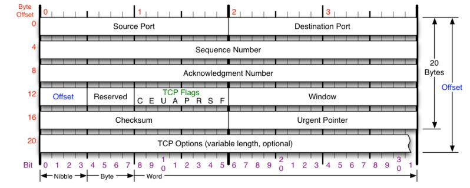
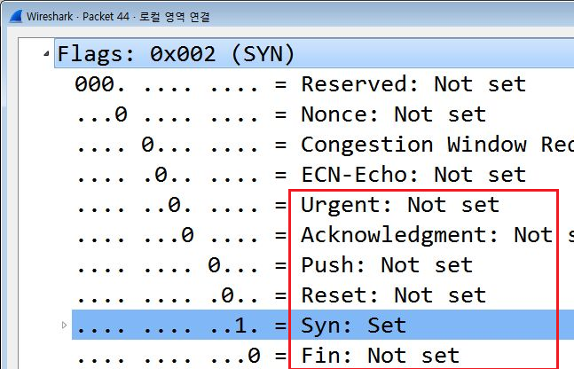
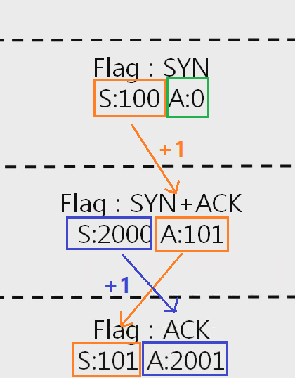

:::tip GOAL
- TCP가 하는 일
- TCP 프로토콜의 구조
- TCP 플래그의 종류
- 각 플래그의 기능
- 3WayHandshake  연결 수립 과정 과 데이터 송수신 과정
- TCP 연결 상태의 변화 3Way Handshaking과 함께보기
- TCP 3Way Handshake 과정 계산해보기
:::

## TCP 프로토콜 하는 일
  연결을 지향하기 때문에 UDP보다는 안정적이다. 일반적으로 통신을 한다고 했을 때
  TCP/IPv4/Ethernet 이렇게 사용한다.
  전송 제어 프로토콜(Transmission Control Protocol, TCP)은 인터넷에
  연결된 컴퓨터에서 실행되는 프로그램 간에 통신을
  안정적으로, 순서대로, 에러없이 교환할 수 있게 한다.
  TCP는 UDP보다 안전하지만 느리다.(이론상으로 그렇지 실제로 유의미하진 않다.)

## TCP 프로토콜의 구조

가장 일반적 길이 20Byte인데 60Byte 까지 늘어 날수 있다.

* Source Port(2Byte): 출발지 포트  
* 목적지 포트 (2Byte)  
* 시퀀스 넘버 4
* ackno.. 4
* 오프셋 : 오프셋이라기보다 헤더길이 /4 해준다.
* 리절브드 : 예약된 필드. 사용하지 않음
* Flag
* 윈도우: 데이터 얼마만큼 더 보내.~ 내 사용공간이 얼마만큼 남아있는 지알려주는 것. 내 남아있는 TCP버퍼  공간 알려주는것
* 체크썸 : 체크썸
* UrgentPointer
* TCP 옵션 : 4 바이트 씩 붙기 해당 옵션때문에 60Byte 까지 늘어 날수 있다.

## TCP Flag
  
박스 친 부분 주의!
TCP는 여러가지 기능을 가지고 있다. 
내가 연결하려고 물어보는 건지, 대답하는건지 연결 종료 하려는 건지 연결 초기화, 데이터 보내려하는지 급한건지 등TCP 주된기능이 이 플래그로 나뉘어 진다.  
* U: 어전트 플래그 긴급비트, 내가 보내는 데이터에 우선순위높은 데이터 포함되어 있다.
Urgent Pointer 와 세트 어디 부터가 긴급데이터인지 알려줌
* A : 애크 플래그, 승인 비트, 물어본거에 대한 응답을 해줄때, 어 데이터 보내도 됨 승인, 어 나랑 연결해도 되 이런식으로 승인 해주는 플래그
* P: push 밀어 넣기, tcp 버퍼가 일정한() 내가 받을 수 있는 공간) 일정 크기 만큼 차야지 추가 전송가능한데 그거 상관 없이 밀어 넣겠다.
* R: 초기화 비트 상대방하고 연결이 되어 있는 상태에서 추가적으로 데이터 주고 받으려고 하는데 문제가 발생 해서 우리 사이 관계를 초기화 하자. 리셋 하자
* S: 동기화 비트 상대방하고 연결을 시작할때 무조건 사용하는 플래그, 얘가 처음 보내지고 난 다음부터 이 둘사이의 연결이 동기화기작한다. 보내도되? 응 보내도되 잘받았어 ? 응 잘받았어
* F: 종료비트 마지막에 데이터 다 주고 받은 휴에 연결울 끊을때 사용하는 플래그다. 

Urgent : 긴급 bit    
Acknowledgment : 승인 bit  
Push : 밀어넣기 bit  
Syn : 동기화 bit  
Fin : 종료 bit  
Reset : 초기화   

 실제 이렇게 셋팅

==ARSF중요==  
## TCP를 이용한 통신과정

 둘 사이의 연결 수립과정: TCP를 이용한 데이터 통신을 할 때 프로세스와 프로세스를 연결하기 위해 가장 먼저 수행되는 과정

1. 클라이언트가 서버에게 요청 패킷을 보내고(서버가 먼저 보내는 경우 x)
2. 서버가 클라이언트의 요청을 수락하면서 서버도 클라이언트에게 연결 요청을 보내고
3. 클라이언트는 이를 최종적으로 수락하는 패킷을 보낸다.
   위의 3개의 과정을 ==3Way Handshake==라고 부른다.

웹, 파일전송, 게임등 우리가 사용하는 대부분의 통신에 사용되며 통신하려고 할때 가장 먼저 수행되는 과정이다.
이 과정 지나고 난 다음에야 데이터 전송이 가능하다.

  
1. 첫번째 연결
첫번째 연결에는 특별한 페이로드 없음. 싱크 플래그 간다.
출발지 포트: 사용자 포트중 아무거나
목적지 포트: 80번 웹이니까.
2. 두번째 연결
목적지에서 디캡슐래이션해서 플래그 보고 나한테 요청하는구나 알아차리고
다시 보낸다. 플래그 싱크랑 애크가 같이 세팅해서 간다.
3. 마지막 연결 수락
결론 : 처음 네트워크 통신할때 3 핸드 쉐이크한다. 각 플래그 셋팅해서 간다.

3웨이 핸드 쉐이크 연결수립!! TCP를 이용한 통신 시작할때 무조건 이루어지는 과정

## TCP 플래그의 시퀸스 애크 번호

조금 더 나아가 보안을 공부한다면 S, A 값 계산 할 줄 알아야한다.

1.  맨 처음 클라이언트가 시퀀스 번호 100 애크 번호 0으로 셋팅했다.(이건 클라이언트 마음 보통 시퀀스에 랜덤 애크 0번 셋팅되서 간다 )
    이랬을 때 받는 쪽에서 이 값과 동기화 시킨다.
2.  애크 번호는 답장을 줄때 받은 시퀀스 번호 +1 을 한다.
    시퀀스 번호는 랜덤하게 생성해서 준다.
3.  애크번호는 받은 시퀀스 번호 +1
    그 다음 시퀀스 번호는 받은 애크번호를 준다.

이제 연결이 수립됐다.
이 다음은 클라이언트가 요청을 보낸다.
이랬을때 클라이언트가 아닌 누군가가 저 값을 가지고 만약 누군가가 동기화된 값을 계산해가지고
서버한테 보내면 어떻게 될까? 이게 세션 하이제킹 ..
로그인 전이라면 문제 없겠지만 이미 로그인 된 후 연결 뺏어갔다고 하면 문제이다.
해커는 저 값을 계산하는 거다.

3웨이 핸드 쉐이크 연결수립!! TCP를 이용한 통신 시작할때 무조건 이루어지는 과정

### TCP 데이터 송수신과정
==3핸드 쉐이크 통한 연결 수립 - >데이터 송수신(일정한 규칙이 있다.) -> 연결종료==

* 연결 수립 다음에 하는 통신에서도 S 번호 A번호 그래로 이어간다
  마지막에 클라이언트 -> 서버로 보내면서 연결 끝났으니
  가지고 있는 값 같다. 여기서 주의점은 다음통신도 클라이언트 -> 서버
  이후 규칙은 +1 이아니라 데이터 크기가 들어간다.

* TCP를 이용한 데이터 통신을 할 때 단순히 TCP 패킷만을 캡슐화해서
  통신하는 것이 아닌 페이로드를 포함한 패킷을 주고 받을 때의 일정한 규칙이 있다!

  1. 보낸 쪽에서 또 보낼 때는 SEQ번호와 ACK번호가 그대로다.
  2. 받는 쪽에서 SEQ번호는 받은 ACK번호가 된다.
  3. 받는 쪽에서 ACK번호는 받은 SEQ번호 + 데이터의 크기

* 연결 종료 방식은 TCP 사용하는 프로그램 만드는 곳 마다 조금씩다르다.

## TCP 상태전이도

TCP의 상태변화

* Listen 상태: 포트번호를 열어놓고 있는 상태, 서버가 포트번호 사용하고 있는, 클라이언트의 요청을 계속 듣고 있는 상태
* ESTABLISHED : 연결이 서로 수립되어 있는 상태 3핸드쉐이크 끝나면 수힙된다.
* CLOSED : 연결 종료

tcp 통신 시작할때 클라이언트는 SYN_SENT 상태가 되고 싱크 요청받은 서버는 Listening상태에서 SYN_RECEIVED상태가 된다. 핸드쉐이크 과정끝나면 클라이언트와 서버가 ESTABLISHED 상태가 되고, 통신가능해진다.

## 실습

wire sg tcp 캡처후 하나 클릭 우클릭 -> follow -> tcp stream 클릭하면 특정 tcp의 연결과정을 볼 수 있다.

point 1. 처음 핸드쉐이크 과정 seq, ack
point 2. 4번째 통신 다시 클라이언트가 서버한테
point 3. 5번째 통신 ack 에는 seq + data (직전 tcp 통신이 보낸 tcp의 페이로드)

## Reference
[따라하며 배우는 IT - 네트워크 기초(YouTube)](https://www.youtube.com/playlist?list=PL0d8NnikouEWcF1jJueLdjRIC4HsUlULi)
