## 실습 목표 : 네트워크 생성

 2개의 퍼블릭 서브넷과 2개의 프라이빗 서브넷이 있는 Amazon Virtual Private Cloud(VPC)를 생성한 다음 퍼블릭 서브넷에서 EC2 인스턴스를 시작합니다.

**사용하는 기술 및 개념**
* Amazon Virtual Private Cloud(VPC)
* Amazon Elastic Compute Cloud(EC2)
* subnets
* gateway
* security group
* route table

## 1. VPC 생성
1. vpc탐색 메뉴바 에서 `your VPCs`를 클릭합니다. 네트워크 설정은 전부 이 탐색메뉴바 안에서 이루어집니다.  
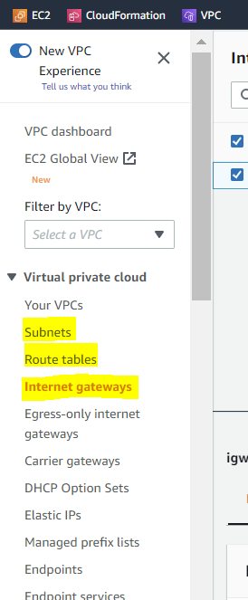

2. vpc를 만듭니다. 이름과 CIDR 범위를 지정합니다.(ex. 이름: lab2, CIDR:10.0.0.0/16 )    
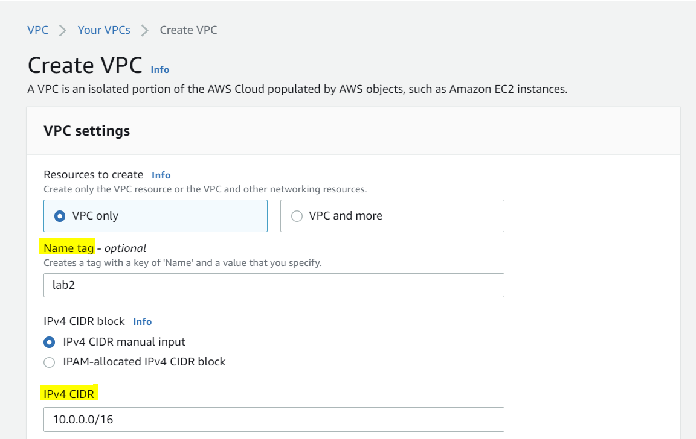

## 2. Subnet 생성
1. VPC에 퍼블릭 2개, 프라이빗 2개 총 4개의 서브넷을 만들어야 합니다. 서브넷 탭으로 들어가 대상 VPC를 선택합니다.   
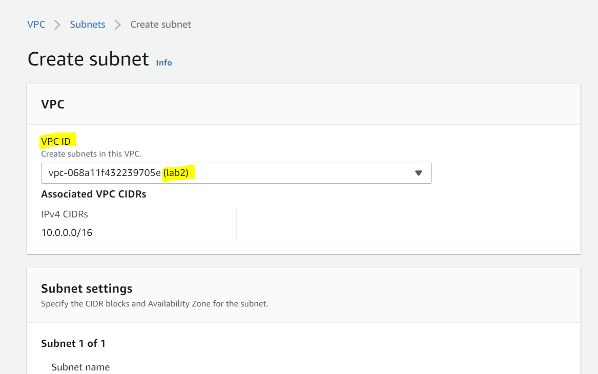 
2. 퍼블릭 서브넷 1을 만듭니다. CIDR: 10.0.1.0/24  
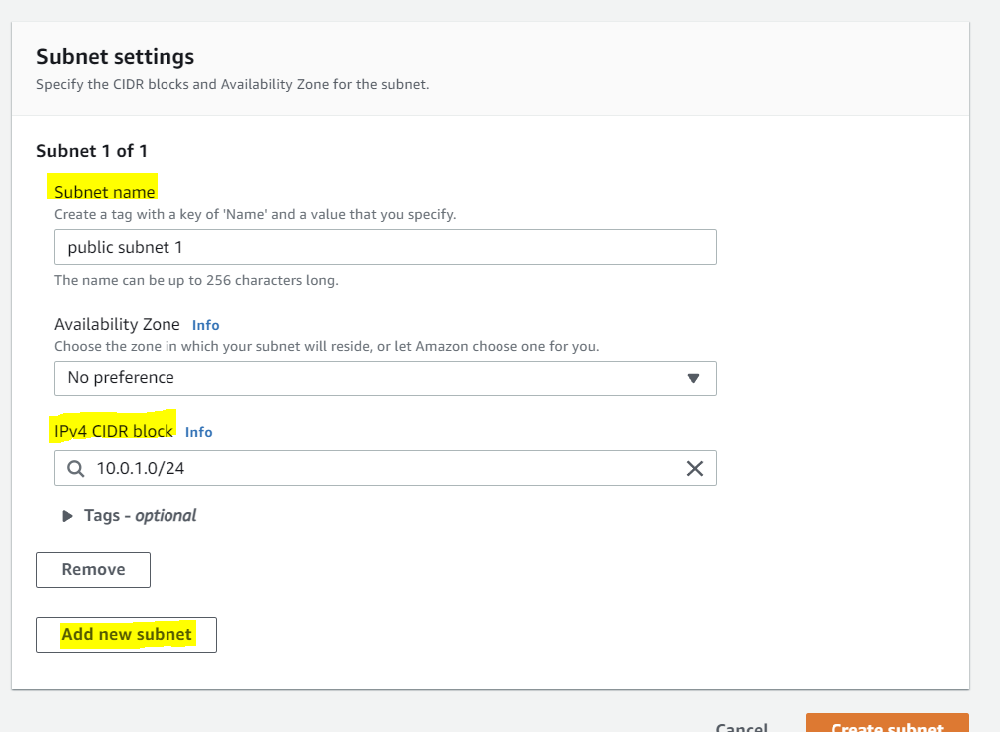
2. 퍼블릭 서브넷 2을 만듭니다. CIDR: 10.0.2.0/24  
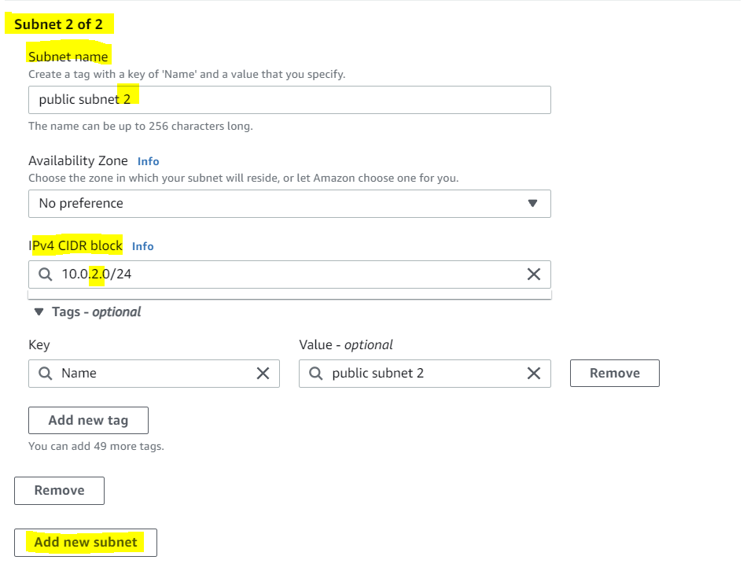
2. 프라이빗 서브넷 1을 만듭니다. CIDR: 10.0.3.0/24  
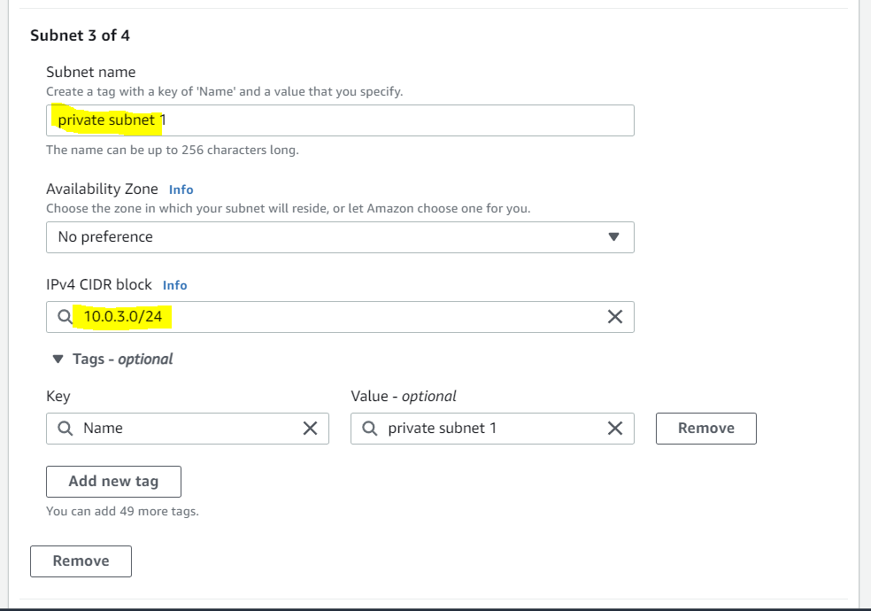
2. 프라이빗 서브넷 2을 만듭니다. CIDR: 10.0.4.0/24  
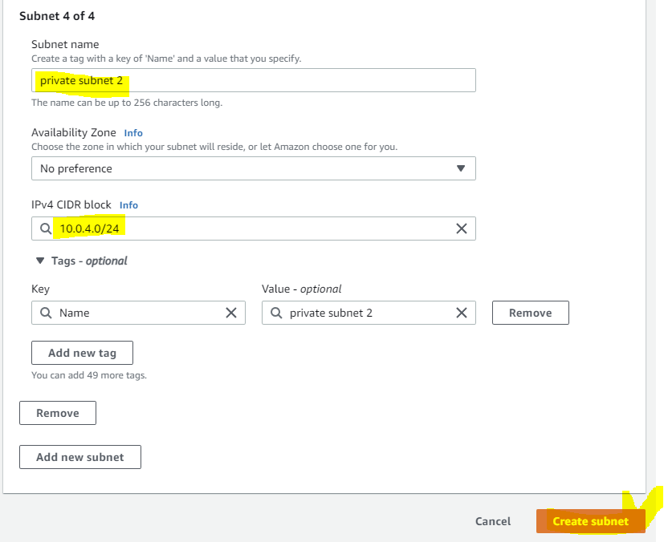

## 3. internet gateway 생성
그 다음으로 해야 할 일은 인터넷 게이트웨이를 만드는 것입니다. 
1. 인터넷 게이트웨이 생성 화면에 들어가 이름을 지정하고 생성합니다.   
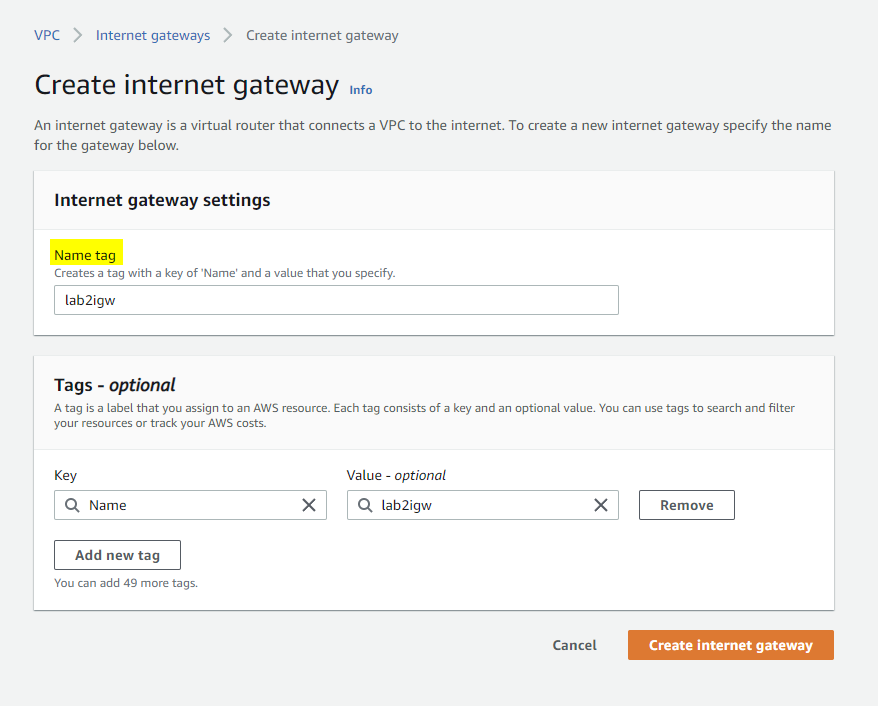

2. 그러나 아직 연결된 vpc가 없어서 상태가 `detached` 입니다. action의 `attach to VPC`를 클릭하여 VPC에 연결합니다.  
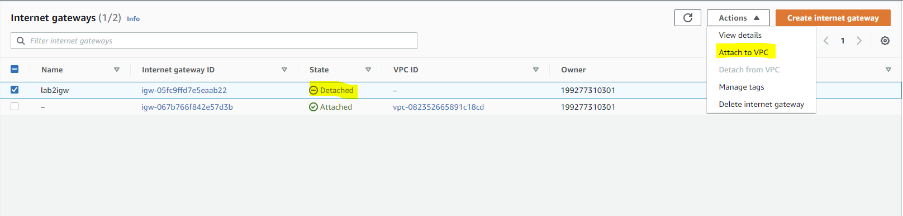  
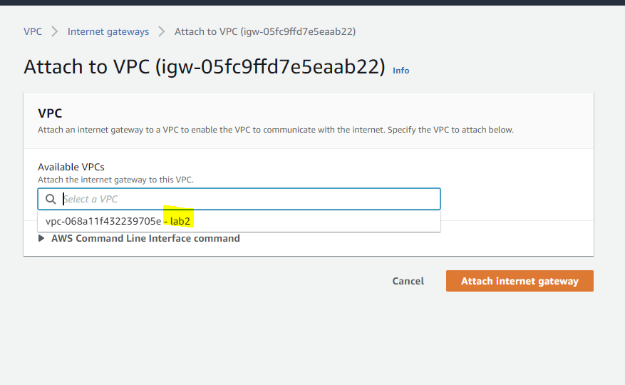

## 4. Configuring the route table
1. 현재는 인터넷 트래픽이 VPC로 흐를 수 있지만 이 인터넷 트래픽이 퍼블릭 서브넷에만 도달하도록 허용하는 경로가 없습니다. 라우팅 테이블로 이동하여 VPC를 선택합니다. 그러면 자동으로 생성된 기본 라우팅 테이블을 확인 할 수 있는데. 이것은 그대로 둡니다. 여기에 인터넷 게이트웨이 경로를 추가하면 공개 및 비공개가 있는 모든 서브넷에 적용되기 때문입니다.   
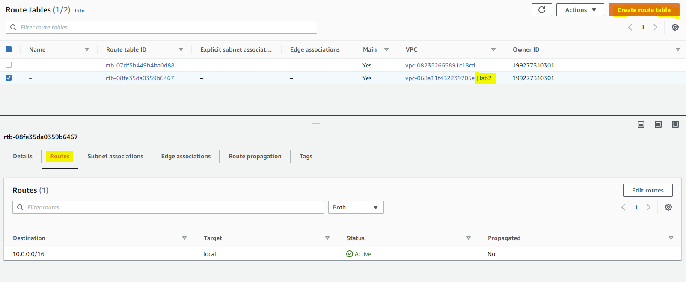

2. public-subnet-route-table라는 이름으로 새 라우팅 테이블을 만듭니다. 그 후 라우팅 테이블을 선택한 다음 Routes - Edit를 클릭합니다.   
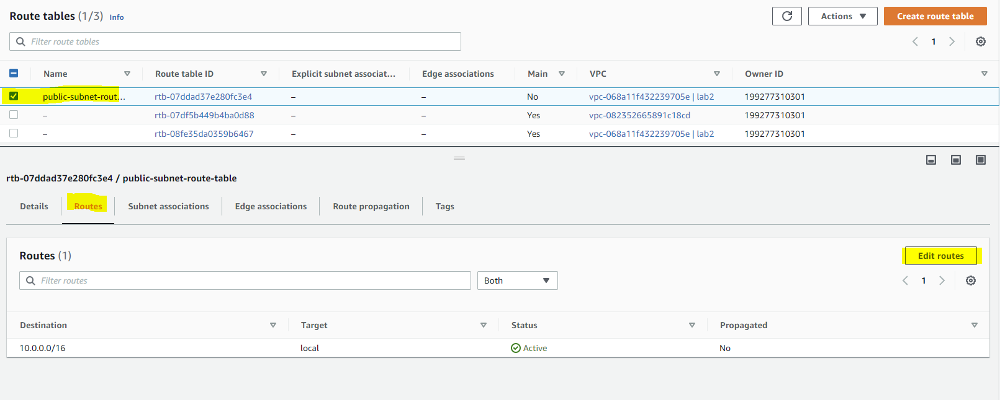

3. destination을 `0.0.0.0/0`로 합니다. 이게 인터넷 트래픽입니다. 그리고 해당 트래픽을 인터넷 게이트 웨이로 라우팅하도록 설정합니다.   
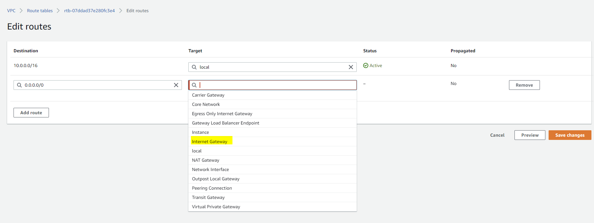
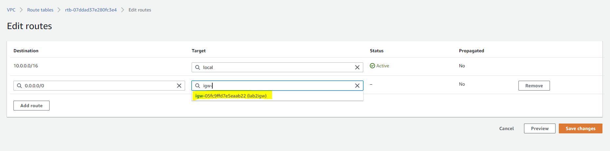

4. 이제 라우팅 테이블이 생겼습니다. 그러나 이 라우팅 테이블이 아직 아무 것도 연결되어 있지 않습니다.  기본 페이지에서 확인하면 새 라우팅 테이블이 아직 기본 라우팅 테이블이 아니라는 것을 알 수 있습니다. 
여기에서 `subnet associations` 항목을 클릭하면 현재 서브넷 연결이 없음을 알 수 있습니다. 따라서 이 라우팅 테이블은 현재 사용되지 않고 있습니다.   
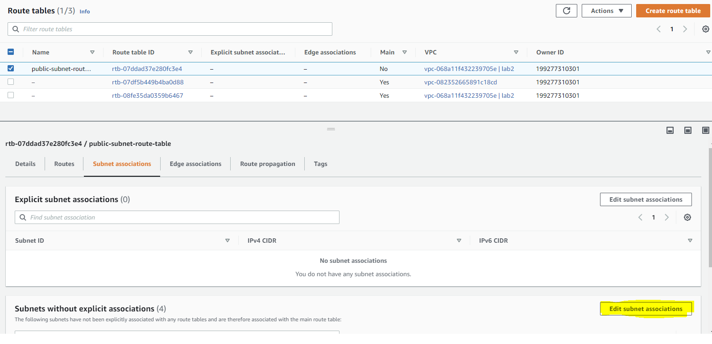

5. 서브넷 연결 편집을 클릭한 다음 여기에서 퍼블릭 서브넷 1과 2를 선택하고 저장합니다.  
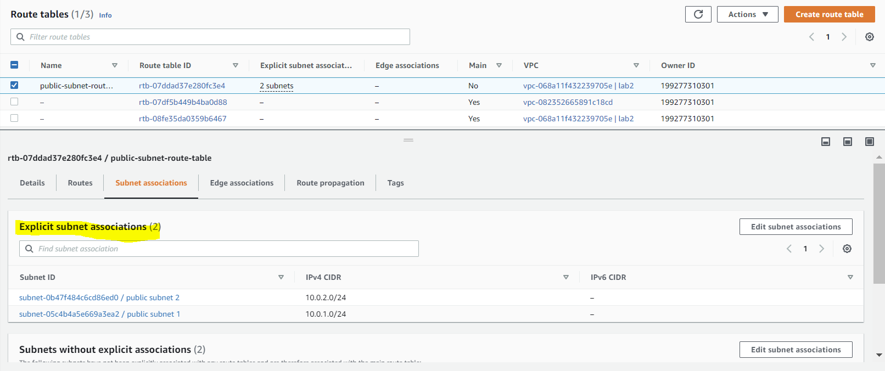 

## 5. Creating the EC2 instance and security group
이제 라우팅 테이블과 연결된 두 개의 서브넷이 있으며 EC2 인스턴스를 이러한 퍼블릭 서브넷 중 하나로 생성하겠습니다.
1.  인스턴스 생성을 누른 후 Amazon Linux 2 AMI를 선택합니다.  
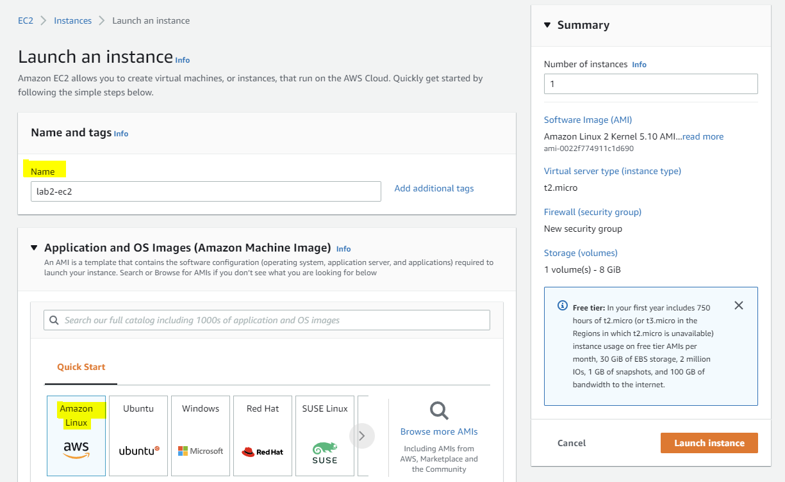
2.  인스턴스 유형을 t2.micro로 선택합니다.  
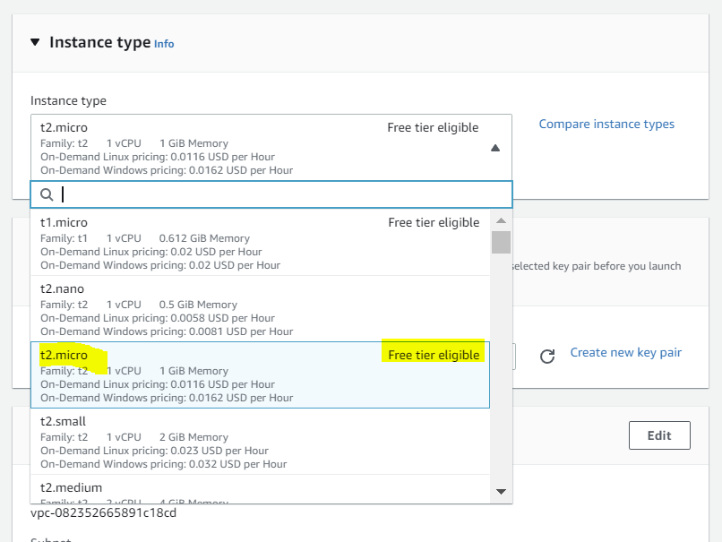  
3. VPC를 선택하고 퍼블릭 서브넷은 1,2 둘 중 아무거나 하나 선택합니다. 퍼블릭 IP 자동 할당을 활성화로 변경합니다.  
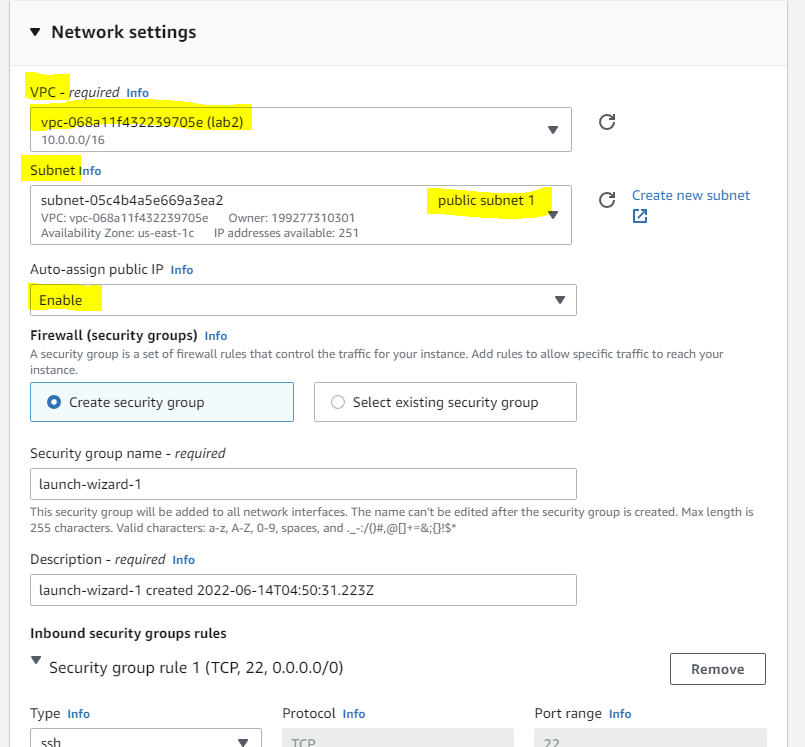  
4. security group 보안그룹 설정은  HTTP 또는 HTTPS의 트래픽을 허용하도록 구성하여 브라우저와 개방형 인터넷에서 액세스할 수 있도합니다.  
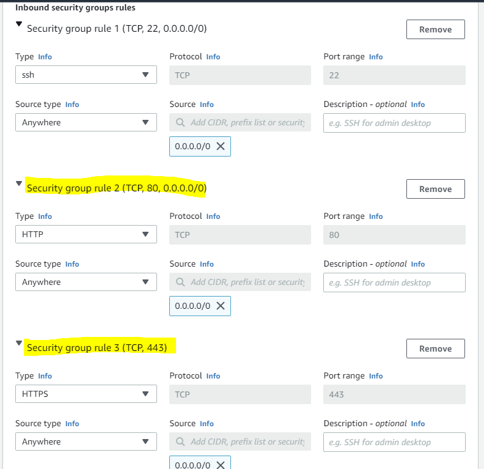

## 6. vpc dns hostnames 설정 
1. 아래와 같이 vpc설정에 가서 dns hostname 설정을 `Enable`로 수정합니다.
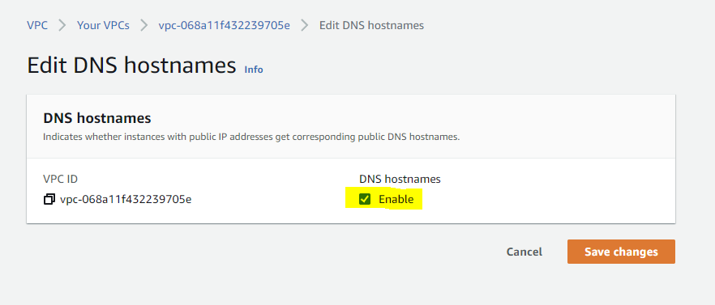

## 마무리
아직 연결이 성공적으로 되었는지 확인 할 방법은 없습니다. ec2에 접속하여 하나의 서버를 구동시키고,
ec2의 `public dns address` 주소로 접근이 되는지 확인합니다.

## Reference

[coursera강의](https://www.coursera.org/learn/aws-certified-solutions-architect-associate)  
[aws FAQ](https://aws.amazon.com/ko/faqs/)