## 실습 목표 : AWS database service 비교

**사용하는 기술 및 개념**
* Amazon Relational Database Service
* Amazon DynamoDB
* Caches

## 1. RDS 인스턴스 생성
1. engine 선택
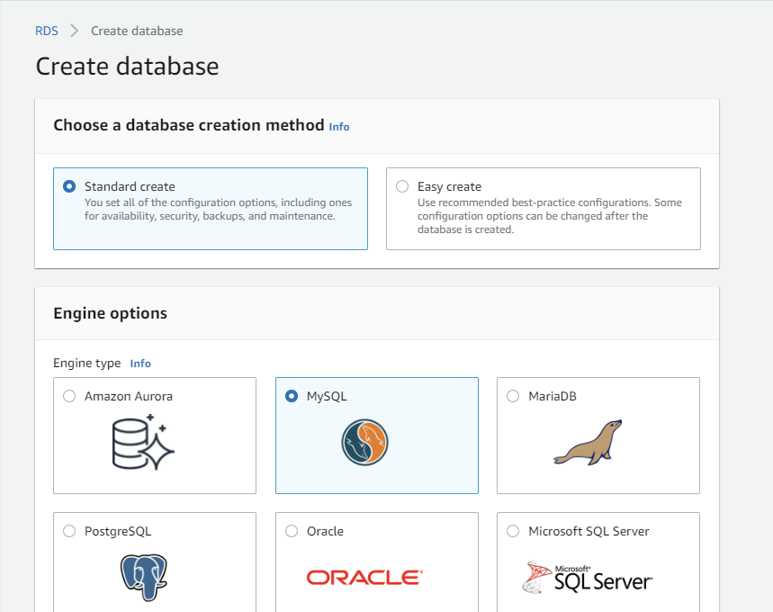
2. free tier 선택
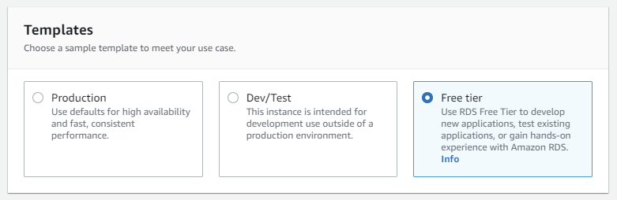
3. DB instance 이름과 접속시 사용할 username, password를 설정
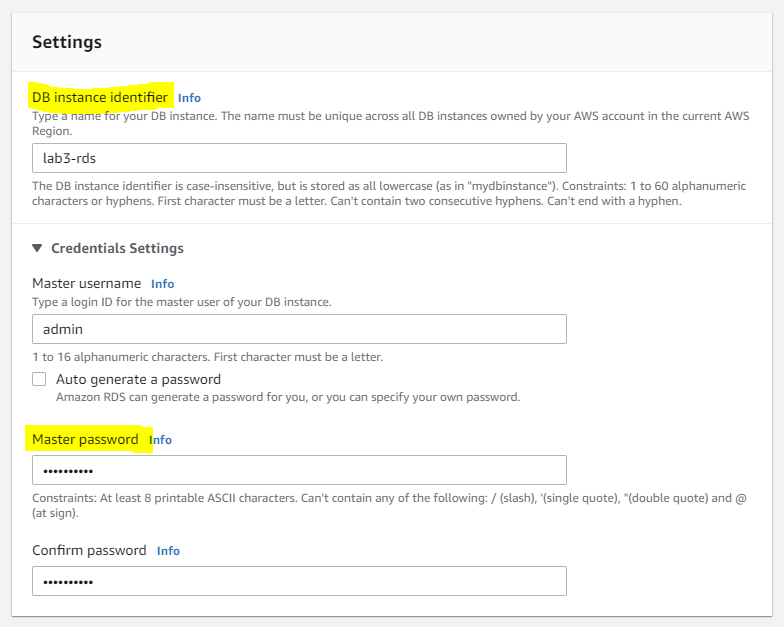
4. VPC와 sebnet group을 선택해준다. 이 실습에서는 default 값들을 사용한다.

## 2. DynamoDB table 생성
1. create table눌러서 생성 창 접속
2. 이름(리전에서 유니크)과 파티션키 설정 후 생성
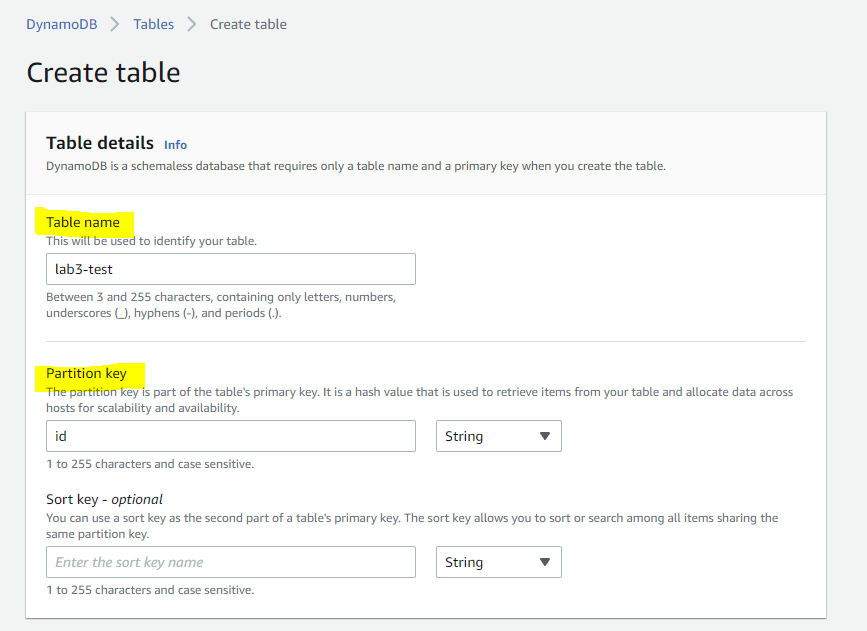

## 3. 생성속도 비교 
* DynamoDB 테이블이 RDS 인스턴스보다 훨씬 빠르게 생성된다. RDS DB 인스턴스는 본질적으로 EC2 기반 유형과 유사한 것으로 부팅된다. 그러나 DynamoDB는 서버리스입니다. 그래서 테이블 생성버튼을 누르면 거의 바로 active 상태가 된 테이블을 확일 할 수 있다. 

##  4. DynamoDB Accelerator DAX 활성화
1. 왼쪽탐색바를 살펴보면 DAX라는 섹션이 있다. 이게 DynamoDB Accelerator이다.  클러스터에 들어가서  클러스터 생성 클릭 *주의 한국 리전에서는 DAX기능 테스트 못함!  
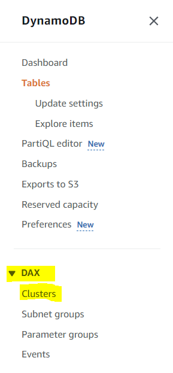
2. 클러스터 이름을 적고  
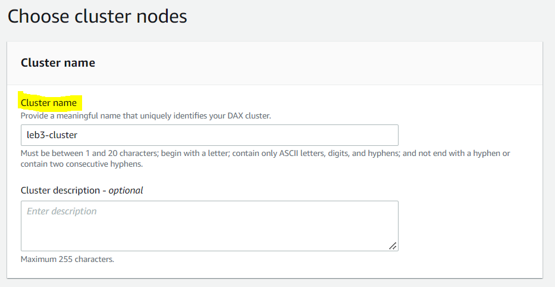
3. node 유형을 선택해야 하는데 여기서는 기본 값인 그대로 간다.  
이 부분은 필요한 성능 유형, 필요한 메모리 양, 필요한 CPU 양 등에 따라 달라진다. 정말 짧은 대기 시간이나 낮은 처리량이 필요한 경우에는 T type family을 사용 할 수 도 있다. 그러니 문서를 잘 읽고 파악한 후에 적합한 제품을 선택하자.
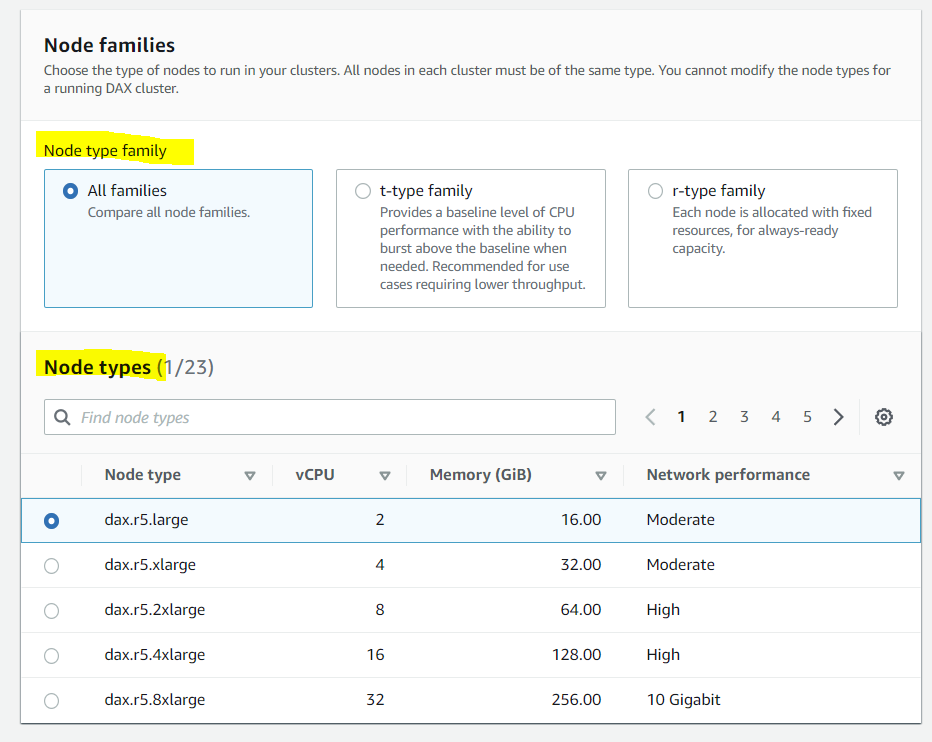
4. 노드 수 선택, 추후 노드를 확장하거나 축소 가능하다.

5. 서브넷 그룹생성시 서브넷 그룹을 생성해야한다. DAX는 이 그룹에 포함된 서브넷에서 클러스터 노드에 네트워크 주소를 할당한다.
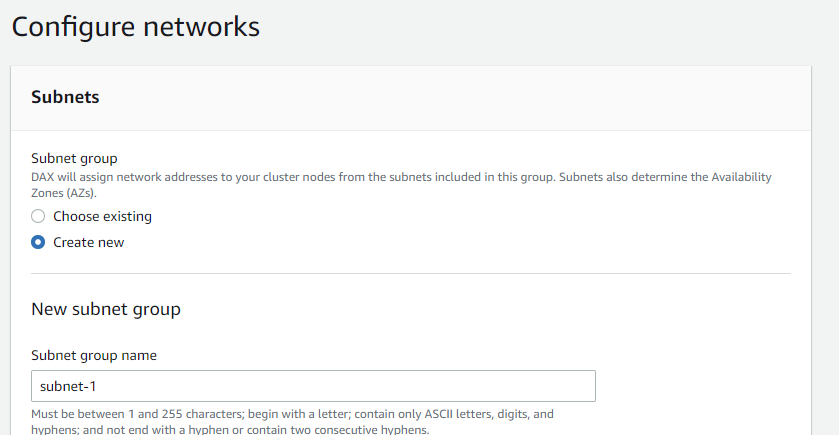
6. vpc 와 서브넷 선탯
사용할 vpc와 서브넷에 대해 특정 서브넷을 선택한다. 여기서 많은 서브넷을 선택할 수 있으며 해당 서브넷에 클러스터 종류가 분산되도록 할 수 있다
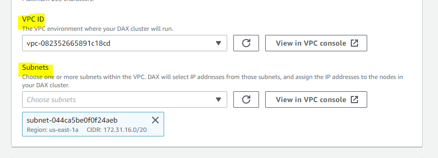
7. 액세스에 관여하는 기본 보안 그룹, 일단 그대로 둔다.
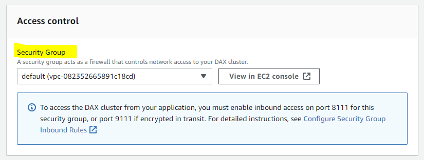
8. AWS Service 역할을 선택한다.(IAM) create를 선택하고 다 기본으로 둔다.
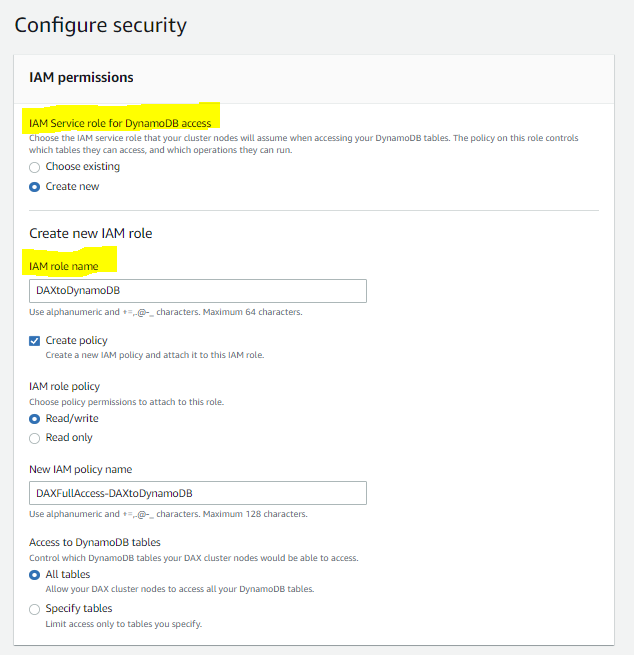
9. option 사항 다양한 설정을 지정할 수 있다 ( 캐시 지속시간, 유지 관리 기간등) 우선 디폴트로 두고 
클러스터를 생성한다.  
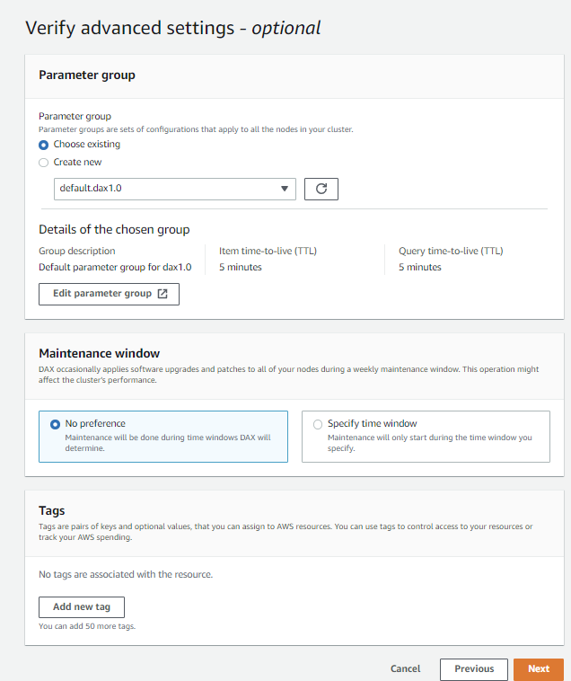
## 5. read replica(읽기 전용 복제) 생성
읽기 전용 복제본은 읽기 작업량이 많을 때 사용한다. 
1. read replica 생성을 클릭 
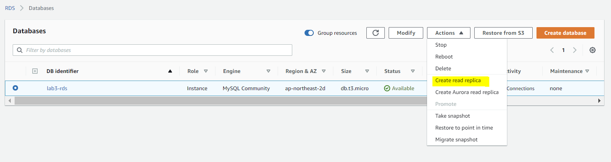
2. 복제본의 이름을 정하고 나머지 값들은 기본값으로 두고 생성한다. 
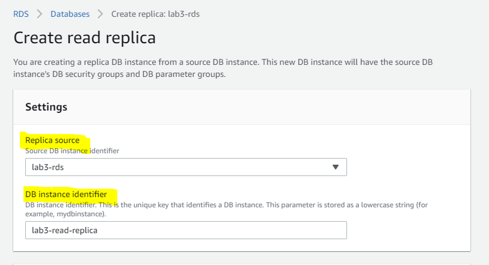
3. 생성된 읽기 전용 복제본을 클릭 상세 정보를 볼 수 있다.
현재 연결이 전혀 없음을 알 수 있지만 원할 경우 이 읽기 전용 복제본을 가리키는 애플리케이션을 만들고 이 복제본에서 데이터를 읽을 수 있습니다. 주의할 점은 이것은 캐시이므로 읽기 요청(read request)만 이곳을 가리키게 된다. 그 외도 모니터링, 로그, 이벤트, 적용할 수 있는 다양한 구성 등을 확인 할 수 있다. 
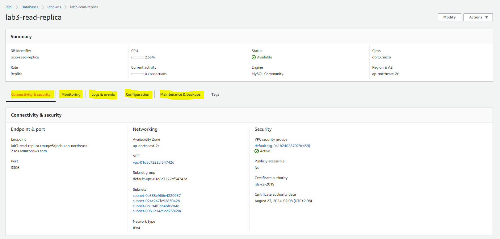

## 6. DynamoDB Accelerator Cluster 와 read replica 작동방식 비교
작동 방식을 살펴보면 EC2 인스턴스에서 실행 중인 애플리케이션이 있고 DynamoDB Accelerator 클러스터와 DynamoDB 테이블이 있다고 가정해보다. DAX 클러스터는 그 사이에 있다. 따라서 모든 읽기 요청, 쓰기 요청, 모든 요청이 이 클러스터로 이동한다. 그런 다음 DynamoDB Accelerator가 클러스터와 실제 테이블 간의 통신을 처리한다. 따라서 애플리케이션에서  Accelerator Cluster 사용하려 할때는 기본적으로 DynamoDB용 클라이언트를 교체하고 DynamoDB Accelerator Client를 배치하기만 하면 된다.

반면에 읽기 전용 복제본을 보면 조금 다르게 설정이 된다 애플리케이션 서버가 있고 Primary 데이터베이스가 있으며 두 번째 읽기 전용 복제본이 있다. 애플리케이션 서버는 기본적으로 Primary 데이터베이스에 읽고/쓰기 작업을 할 수 있다. 그러나 데이터 보고나 데이터 집계 또는 매우 긴 쿼리 수행과 같이 read-heaby 요청이 있을 때 이러한 작업은 전용 읽기 전용 복제본으로 요청을 보낸다면 효율적인 아키텍쳐가 될 것이다. 

 DynamoDB Accelerator Cluster 와 read replica 이것들은 일종의 다른 아키텍처이다.

## 마무리
RDS의 Read replica에서는 기본에서 읽고 쓰기를 수행한 다음 읽기 전용쿼리가 있다면 이 읽기 전용 복제본으로 이동한다. 따라서 요청을 지시할 위치를 알고 있어야 한다. 반면 DynamoDB Accelerator를 사용하면 애플리케이션이 클러스터와 통신하고 그런 다음 모든 통신이 뒤에서 처리된다