## 실습 목표 : 탄력성 있는 아키텍처 구성

Amazon Elastic Compute Cloud(Amazon EC2)에서 애플리케이션을 시작한다. 애플리케이션은 확장 가능하고 가용성이 높아야 한다. Amazon EC2 Auto Scaling 그룹 및 Application Load Balancer를 설정하는 작업을 해야한다.

**사용하는 기술 및 개념**
* Application Load Balancer
* Amazon EC2 Auto Scaling group

## 1. 실습에 들어가기전 구성 확인
이 실습을 하기 위해서는 먼저 VPC 하나와 거기에 포함된 프라이빗 서브넷 2개, 퍼블릭 서브넷 2개, 또 HTTP, HTTPS에 대하여 통신이 열려있으며 VPC에 적용되어 있는 보안그룹도 필요하다. domain2 실습에서 모든 구성을 담은 실습을 진행했었다. 

## 2. launch Template 생성
1. EC2의 사이드 바에서 launch Template 클릭  
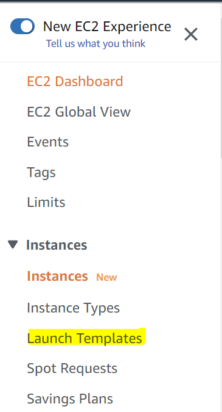
2. launch Template 이름 입력 
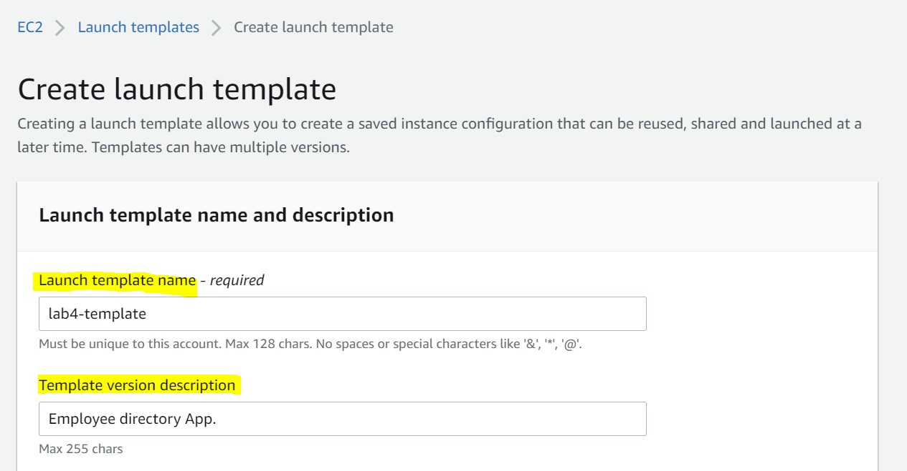
3. AMI와 인스턴스 유형 선택
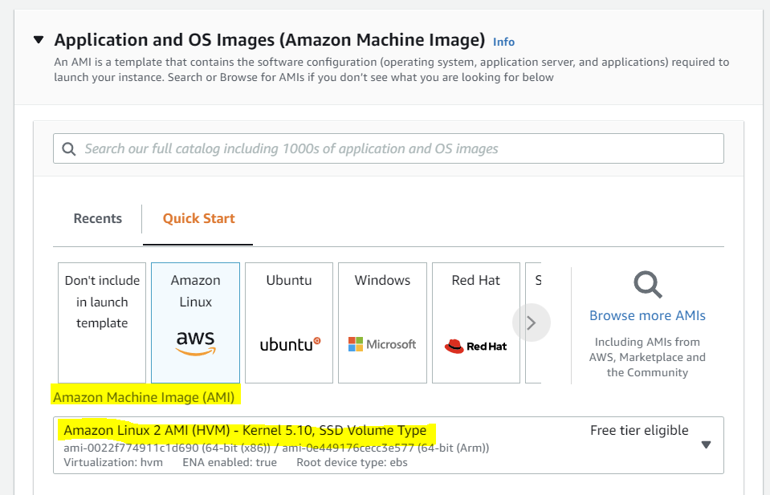
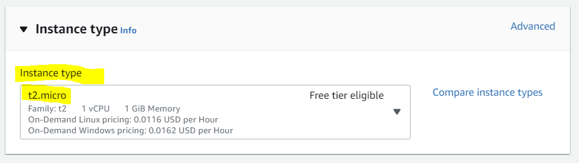
4. 네트워크 설정에서 네트워크 인터페이스를 추가를 클릭 (주의!!!)
1] 자동 할당 공용 IP를 활성화로 변경 (주의, 백엔드 인스턴스에 공개 IP를 할당한다는 것 로드 밸런서를 통해 인스턴스에 액세스할 것이기 때문에 반드시 활성화할 필요는 없다. 기술적으로 어떤 상황에서는 공개 IP가 필요하지 않다. 생성 할 애플리케이션이 인터넷에서 외부적으로 호스팅되는 소스 코드를 다운로드할 것이기 때문에 이 공개 IP를 활성화하였다)  
2]  이미 만들어 놨던 시큐리티 그룹을 선택한다.  
(주의, 이 보안 그룹은 인스턴스와 Application Load Balancer에 적용된다. 이 구성은 실습을 위한 것이므로 필요한 경우 인스턴스에 직접 연결할 수 있다. 실제 구성 할 때는 로드 밸런서를 통해 액세스할 수 있다. 그런 다음 해당 응용 프로그램이 외부에서 모든 코드를 다운로드할 수 있도록 하는 NAT 게이트웨이와 같은 것을 갖도록 구성해야 한다)   
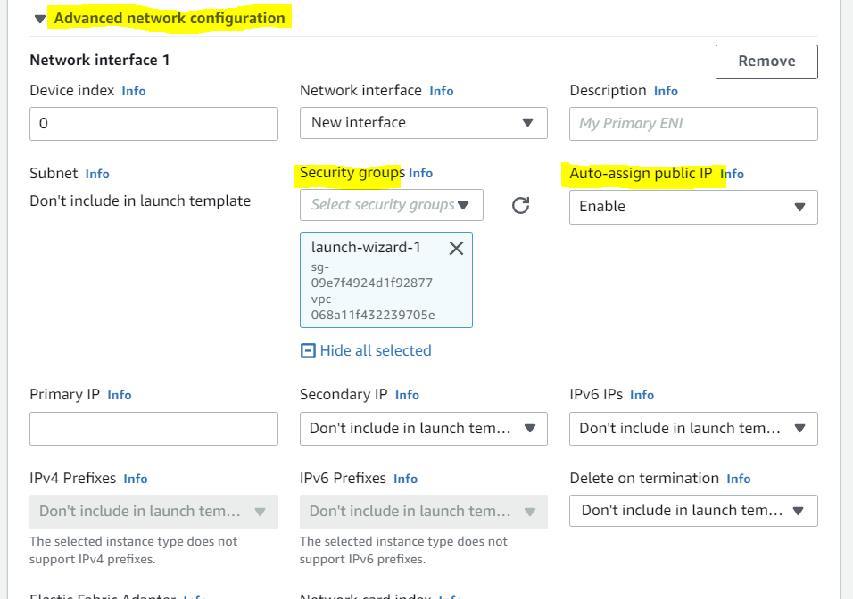

5. user data 입력(선택)  
아래 스크립트 내용은 주어진 링크에서 소스 코드를 다운로드한 다음 압축을 풀고 설치하고 모든 종속성을 설치하는 동작이 명시되어있다. 실습을 위해 코세라에서 제공하는 스크립트이다. 인터넷에 액세스할 수 있는 인스턴스가 없고 NAT 게이트웨이가 설정되어 있지 않거나 NAT 인스턴스가 없으면 실패한다. 

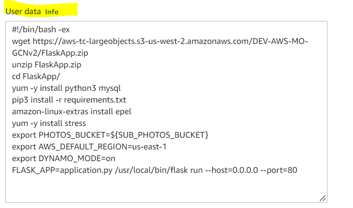

## 3. Auto Scaling group 및 Load Balancer 생성
1. 탭에서 `Auto Scaling group` 클릭  
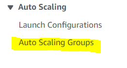

2. 이름 지정  
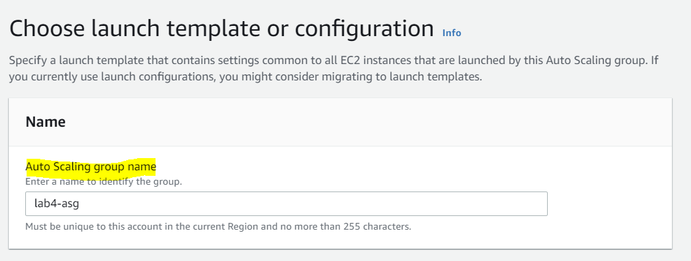

3. 템플릿과 버전 선택  
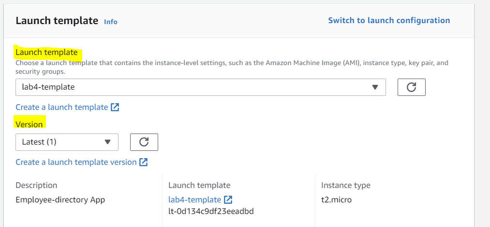

4. 네트 워크, VPC와 퍼블릭 서브넷 선택  
퍼블릭 서브넷이 두 개의 서로 다른 가용 영역에 있다. 이로써 로드 밸런서가 두 개의 가용 영역 간에 트래픽을 분산할 수 있다.  
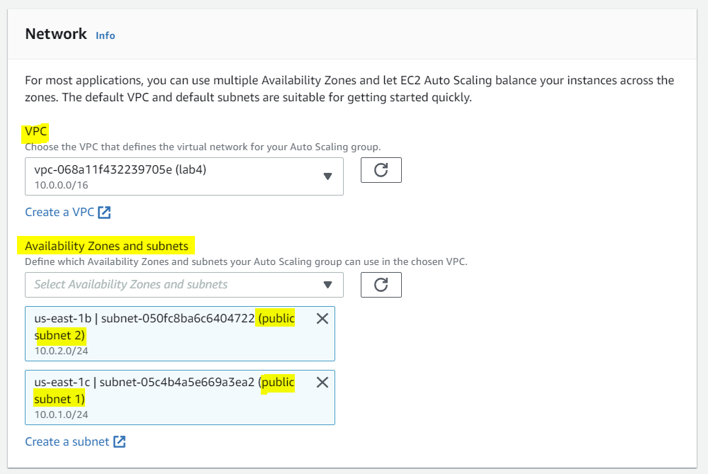
5. 새 로드 밸런서 생성 클릭  
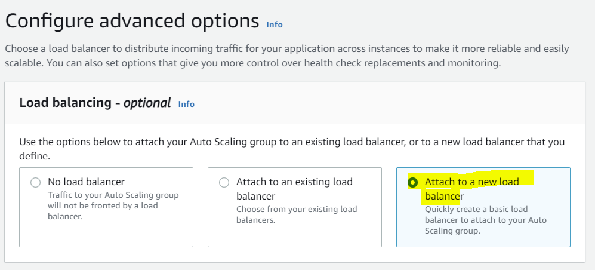  
6. 로드 밸런서 기본 설정 입력  
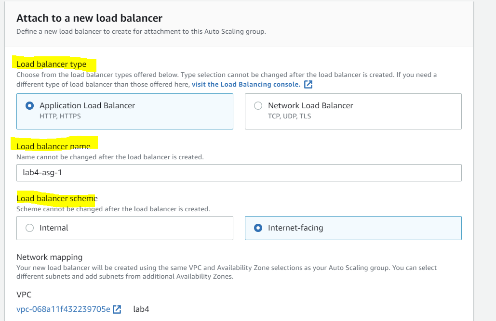  
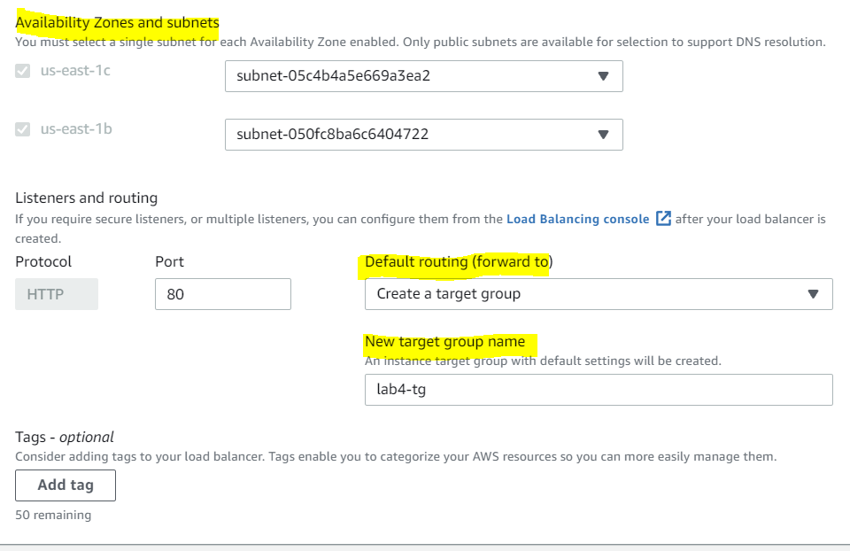  
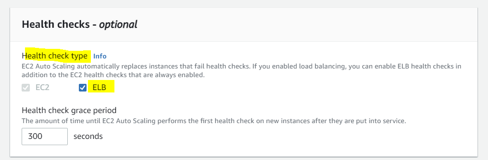  
7. Auto Scaling 그룹 사이즈 설정   
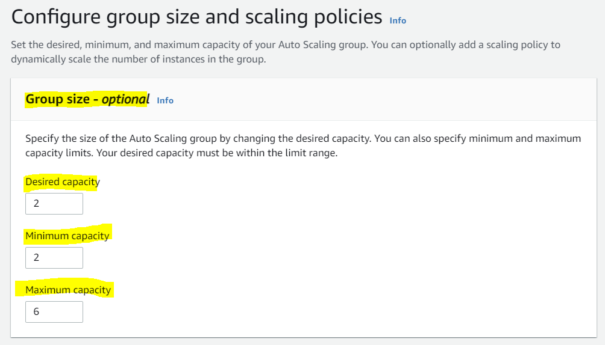 
8. Auto Scaling 그룹  확장 정책 설정   
사용 사례에 따라 특정 메트릭을 변경할 수 있다.  
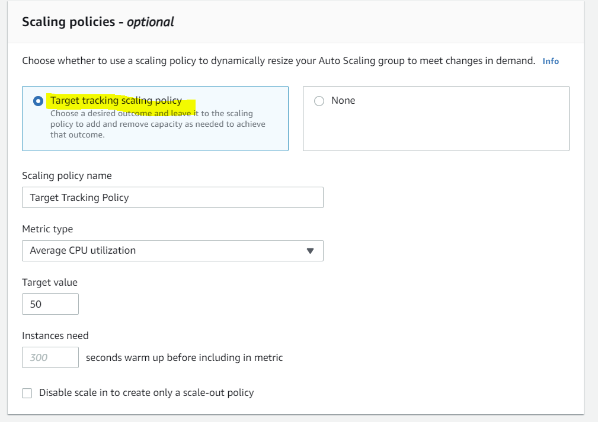  

## 확인 
1. EC2 자동 생성 확인. 최소 사이즈인 2개가 생성되어 있다.  
시스템로그를 확인하여 정상적으로 작동하는 걸 확인 할 수 있다.
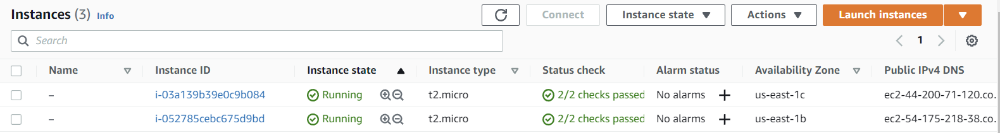  
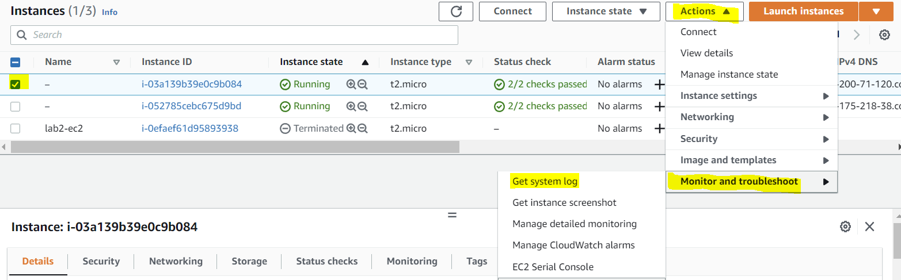  
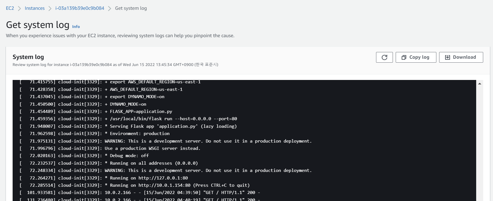  
2. 로드 밸런싱을 클릭한 다음 DNS의 주소로 접근하여, 해당 ec2들에 접근 할 수 있다
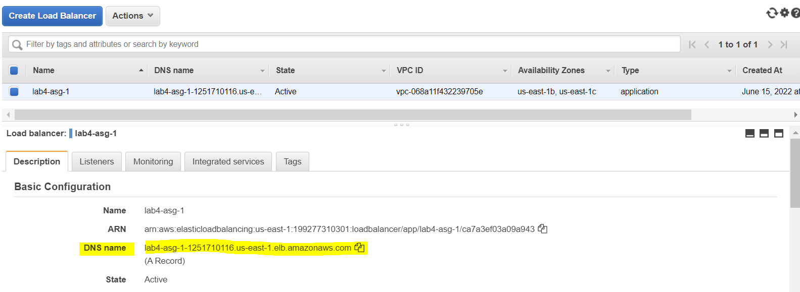  
3. 로드 밸런서가 요청의 균형을 조정하여 각 EC2에 요청을 보낸다. CPU에 과한 스트레스를 주는 경우 스케일링이 발생하여 아래처럼 자동적으로 EC2가 늘어난다. 
 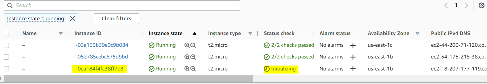  

 ## Reference

[coursera강의](https://www.coursera.org/learn/aws-certified-solutions-architect-associate)  
[aws FAQ](https://aws.amazon.com/ko/faqs/)