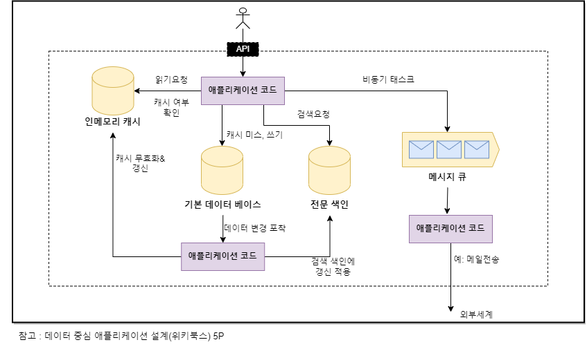

> "이제부터 개발자는 애플리케이션 개발자뿐만 아니라 데이터 시스템 설계자이기도 하다"

## 데이터 중심 애플리케이션

오늘날 많은 애플리케이션은 **계산 중심(compute-intensive)** 이 아닌 **데이터 중심(data-intensive)** 적이다.
이러한 애플리케이션에서 성능을 제한 하는 요소는 CPU보다는 데이터의 양, 데이터의 복잡도, 데이터의 변화 속도다.
일반적으로 이런 데이터 중심 애플리케이션은 공통으로 아래와 같은 요소들을 필요로 한다.

```
- 데이터를 저장 (DB)
- 읽기 속도 향상을 위해 값이 비싼 수행 결과를 기억 (캐시)
- 키워드로 데이터 검색하거나 필터링 하게 제공 (검색색인-search index)
- 비동기 처리를 위해서 다른 프로세스로 메세지 전송(스트림 처리-stream processing)
- 주기적으로 대량의 누적된 데이터를 분석(일괄/배치 처리-batch processing)
```

오늘날의 데이터 시스템은 성공적으로 추상화 되어있어서 위와 같은내용이 당연하게 들리기도 한다. 그러나 현실은 이론 만큼 간단하지 않다. 데이터 베이스 시스템 또한 저마다의 특성을 가지고 있기 때문에 애플리케이션을 만들 때 어떤 도구와 어떤 접근 방식이 수행 중인 작업에 가장 적합한지 생각해야 한다.이 후 이 책을 공부해 나가면서 다양한 도구의 공통으로 지닌 것은 무엇인지 서로 구별되는 것은 무엇인지 그리고 어떻게 그러한 특성을 구현해냈는지 알아본다.

## 데이터 시스템에 대한 생각

일반적으로 데이터베이스, 캐시등은 데이터 저장이란 측면에서 표면적으로 비슷하더라도 매우 다른 접근 패턴을 갖고 있어 서로 다른 성능특성이 있기 때문에 구현방식이 매우 다르다.

그런데 왜 이를 데이터 시스템이라는 포괄적 용어로 묶어야할까?

첫 번째로 최근에 등장한 데이터 시스템 도구들은 다양한 사용사례에 최적화 되었기 때문에 더 이상 전통적인 분류에 딱 들어맞지 않는다. 메세지 큐로 사용하는 데이터 스토어인 레디스, 데이터 베이스처럼 지속성을 보장하는 메세지 큐인 아파치 카프카 등을 예로 들 수 있다. 분류간의 경계가 흐려지고 있다.

두 번째로는 점점 더 많은 애플리케이션이 단일 도구로는 더이상 데이터 처리와 저장 모두를 만족 시킬 수 없는 광범위한 요구사항을 가지고 있다, 대신 작업(work)을 단일 도구에서 효율적으로 수행할 수 있는 태스크(task)로 나누고 **다양한 도구들은 애플리케이션 코드를 이용해 서로 연결 한다.** 예를 들어 전문검색서버의 경우 메인 데이터 베이스와 동기화된 캐시나 색인을 유지하는 것은 보통 애플리케이션 코드의 책임이다. 아래 그림을 보자.



이렇듯 서비스 제공을 위해 각 도구를 결합할때 API는 클라이언트가 모르게 세부 구현사항을 숨긴다.
**이제부터 개발자는 애플리케이션 개발자뿐만 아니라 데이터 시스템 설계자이기도 하다.**

## 신뢰성, 확장성, 유지보수성

데이터시스템이나 서비스를 설계할 때 까다로운 문제가 많이 생긴다.  
내부적으로 문제가 있어도 데이터를 정확하고 완전하게 유지하려면 어떻게 해야 할까?  
일관되게 좋은 성능은 어떻게 제공할 수 있을지?  
부하증가를 다루기 위해 어떻게 규모를 확장할까?  
서비스를 위해 좋은 API는 어떤 모습일까?

이 책에서는 대부분의 소프트웨어 시스템에서 중요하게 여기는 세가지 관심사에 중점을 둔다.

```
신뢰성(Reliability)
하트웨어나 소프트웨어 결함, 인적 오류 같은 역경에 직면하더라도 시스템은 올바르게 동작해야 한다.

확장성(Scalability)
시스템의 데이터의 양, 트래픽 양, 복잡도가 증가해도 이를 처리할 수 있는 적절한 방법이 있어야한다.

유지보수성(Maintainability)
모든 사용자가 시스템 상 에서 생산적으로 작업할 수 있게 해야 한다.
```

각 단어를 이해하는 것, 개발할 때 이 3가지 관점에서 설게하고 구현하는 것은 좋은 개발자가 갖춰야 하는 자질 중에 하나라고 생각한다.
각 단어에 대한 자세한 설명은 다음 포스팅에서 계속하겠다.

## 오늘의 공부 한마디

시스템이 복잡해질수록 API 에서 처리할 일은 많아진다. 실무에서 데이터를 다루기 위해 어떤 기술들이 있고, 이러한 기술들이
어떻게 연결되어있는지 또 개발자의 역할은 무엇인지 머리로 대략적으로 알고 있던 것을 이렇게 정리해 볼 수 있다는 것은 좋은 공부의 기회이다. 아직 복잡한 아키텍처는 다뤄본적이 없지만 실무에서 다뤄볼 기회가 오길 바란다.
