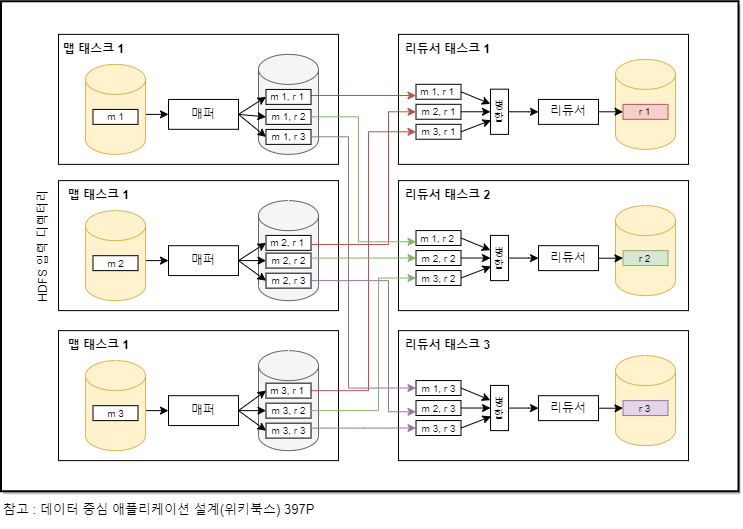

## 맵리듀스와 분산 파일 시스템

**맵리듀스는 유닉스 도구와 비슷한 면이 있지만 수천 대의 장비로 분산해서 실행이 가능하다는 점이서 차이가 있다.** 맵리듀스 작업도 유닉스와 마찬가지로 입력을 수정하지 않기 때문에 출력을 생산하는 것 외에 다른 부수 효과는 없다.

유닉스에서는 stdin, stdout으로 주고받던 입출력을 맵 리듀스에서는 분산 파일 시스템 상의 파일 형태로 다루게 된다. 하둡 맵리듀스 구현에서 이 파일 시스템은 HDFS(Hadoop Distribute File System)이라고 한다.

HDFS는 비공유 원칙을 기반으로 하는데 NAS와 SAN 아키텍처에서 사용하는 공유 디스크 방식과는 반대다. 공유 디스크 저장소는 중앙 집중 저장 장치를 사용하는 데 맞춤형 하드웨어를 사용하거나 파이버 채널과 같은 특별한 네트워크 인프라를 사용하기도 한다. 반면 비공유 방식은 특별한 하드웨어가 필요 없고, 일반적인 네트워크에 연결된 컴퓨터면 충분하다.

HDFS는 각 장비에서 실행되는 데몬 프로세스로 구성된다. 다른 노드가 해당 장비에 저장된 파일에 접근 가능하게끔 네트워크 서비스를 제공한다. 네임 노드(NameNode)라고 부르는 중앙 서버는 특정 파일 블록이 어떤 장비에 저장됐는지 추적한다. 따라서 HDFS는 개념적으로는 매우 큰 하나의 파일 시스템이고 데몬이 실행 중인 모든 장비의 디스크를 사용할 수 있다. 장비가 죽거나 디스크가 실패하는 경우에 대비하기 위해 파일 블록은 여러 장비에 복제된다.

HDFS는 확장성이 뛰어나다. 이를 이용한 데이터 저장과 접근 비용은 범용 하드웨어와 오픈소스 소프트웨어를 사용하기 때문에 동급 용량의 전용 저장소 장치를 사용하는 비용보다 훨씬 저렴하다. 그렇기 때문에 이런 대규모 확장이 가능하다.

### 1. 맵리듀스 작업 실행하기

맵리듀스는 HDFS 같은 분산 파일 시스템 위에서 대용량 데이터셋을 처리하는 코드를 작성하는 프로그래밍 프레임워크.

1. 입력 파일을 읽는다. 레코드로 쪼갠다.

2. 각 입력 레코드마다 매퍼 함수를 호출해 키와 값을 추출한다.(사용자 작성 코드)

3. 키를 기준으로 키-값 쌍을 모두 정렬한다.

4. 정렬된 키-값 쌍 전체를 대상으로 리듀스 함수를 호출한다.(사용자 작성 코드)

맵리듀스 작업을 생성하려면 다음과 같이 동작하는 매퍼와 리듀서라는 두 가지 콜백 함수를 구현해야 한다.

매퍼(Mapper)

모든 입력 레코드마다 한 번씩만 호출된다. 입력 레코드로부터 키와 값을 추출하는 작업이다. 각 입력으로부터 생성하는 키-값 쌍은 빈 쌍을 포함해 원하는 만큼 생성 가능하다. 다음 레코드까지 상태를 유지하지 않기 때문에 각 레코드를 독립적으로 처리한다.

리듀서(Reducer)

매퍼가 생산한 키-값 쌍을 받아 같은 키를 가진 레코드를 모으고 해당 값의 집합을 반복해 리듀서 함수를 호출한다. 리듀서는 출력 레코드를 생산한다.

### 2. 맵리듀스의 분산 실행

**맵리듀스는 병렬로 수행하는 코드를 직접 작성하지 않고도 여러 장비에서 동시에 처리가 가능하다.** 매퍼와 리듀서는 한 번에 하나의 레코드만 처리하고 입력이 어디서 오는지 출력이 어디로 가는지 신경 쓰지 않는다. 맵리듀스 프레임워크가 장비 간에 데이터가 이동하는 복잡한 부분을 처리하기 때문이다.

병렬 실행은 파티셔닝을 기반으로 한다. 작업 입력으로 HDFS상의 디렉터리를 사용하는 것이 일반적이고, 각 파일 또는 파일 블록을 독립된 맵 태스크에서 처리할 독립 파티션으로 간주한다.

1. 매퍼가 입력 파일을 읽어서 정렬된 출력 파일을 기록하기를 완료하면

2. 맵리듀스 스케줄러는 매퍼에서 출력 파일을 가져올 수 있다고 리듀서에게 알려준다.

3. 리듀서는 각 매퍼와 연결해서 리듀서가 담당하는 파티션에 해당하는 정렬된 키-값 쌍 파일을 다운로드한다. 리듀서를 기준으로 파티셔닝 하고 정렬한 뒤 매퍼로부터 데이터 파티션을 복사하는 과정을 셔플이라 한다.

4. 리듀스 태스크는 매퍼로부터 파일을 가져와 정렬된 순서를 유지하면서 병합한다. 병합된 이후 리듀서의 입력으로 들어갈 때는 서로 인접하게 된다.

리듀서는 키와 반복자(iterator)를 인자로 호출하는데 이 반복자로 전달된 키와 동일한 키를 가진 레코드를 모두 훑을 수 있다. 리듀서는 임의의 로직을 사용해서 이 레코드들을 처리하고 여러 출력 레코드를 생성할 수 있다. 이 출력 레코드는 분산 파일 시스템에 파일로 기록된다.  

### 3. 맵리듀스 워크플로

맵리듀스 작업 하나로 해결할 수 있는 문제의 범위는 제한적이기 때문에 맵리듀스 작업을 연결해 워크플로로 구성하는 방식을 일반적으로 사용한다. 맵리듀스 작업 하나의 출력을 다른 맵리듀스 작업의 입력으로 사용하는 식이다. 프레임워크가 직접 제공하지 않기 때문에 첫 번째 작업은 HDFS상에 지정된 디렉터리에 출력하도록 설정하고 두 번째 작업은 해당 디렉터리를 입력으로 사용하도록 설정해야 한다. 두 작업은 완전히 독립적으로 동작한다.

### 4. 리듀스 사이드 조인과 그룹화

맵리듀스에는 적어도 일반적으로 이야기하는 색인 개념이 없다. 입력 파일 전체 내용을 읽는데 데이터베이스에서 이 연산을 full table scan이라 부른다. 적은 수의 레코드만 읽고 싶을 때 full table scan을 사용한다면 색인 탐색에 비해 비용이 터무니없게 많이 든다. 그러나 분석 질의는 대량의 레코드를 대상으로 집계 연산을 하는 것이 일반적이다. 이런 경우 입력 전체를 스캔하는 건 상당이 합리적이다. 여러 장비에 걸쳐 병렬 처리가 가능한 경우는 특히 그렇다.
일괄 처리 맥락에서 조인은 데이터셋 내 모든 연관 관계를 다룬다는 뜻이다. 예를 들면 특정 사용자의 데이터 만을 찾는 것이 아니라 모든 사용자 데이터를 동시에 처리한다.
일괄처리에서 하나의 이벤트 테이블과 여러 데이터 베이스에 있는 유저 테이블을 조인할 때 가장 간단하게 구현하는 방법은 하나씩 활동 이벤트를 훑으면서 나오는 모든 사용자 ID마다 원격 서버에 있는 사용자 DB에 요청을 보내는 것이다. 안될 건 없지만 성능이 좋지 않다.
일괄 처리에서 처리량을 높이기 위해서는 가능한 한 한 장비 내에서 연산을 수행해야 한다. 처리할 모든 레코드를 네트워크를 통해 임의 접근 요청을 하는 것은 너무 느리다. 또한 원격 데이터베이스에 질의한다는 건 일괄 처리가 비결정적이라는 뜻이다.
좋은 방법은 데이터베이스의 사본을 가져와 분산 파일 시스템에 넣는 방법이다. 그러면 사용자 데이터베이스가 같은 HDFS상에 존재하고 맵리듀스를 사용해 연관된 레코드끼리 모두 같은 장소로 모아 효율적으로 처리가 가능하다.

- 정렬 병합 조인 알고리즘

조인할 각 입력은 조인 키를 추출하는 매퍼를 통과한다. 맵리듀스 프레임워크에서 키로 매퍼의 출력을 **파티셔닝**해 키-값 쌍으로 **정렬**한다면 같은 사용자의 조인할 각 값은 리듀서의 입력으로 서로 인접해서 들어간다. 매퍼 출력이 키로 정렬된 후에 리듀서가 조인의 양측을 정렬된 레코드 목록을 병합하기 때문이다. 즉 조인 키를 추출하는 매퍼를 통과한 후 파티셔닝, 정렬, 병합 과정을 마치면 같은 키를 가지는 모든 레코드는 하나의 리듀서에서 호출된다. 이 리듀서 함수에서 병합된 레코드를 출력할 수 있다.
이렇게 함으로써 리듀서는 특정 데이터 ID의 모든 레코드를 한 번에 처리하므로 한 번에 하나의 ID와 관련된 정보만 메모리에 유지하면 되고 네트워크로 아무 요청도 보낼 필요가 없다.

- 같은 곳으로 연관된 데이터 가져오기

위 알고리즘에서 특정 ID조인 연산 시 필요한 모든 데이터를 한 곳에 모은다. 매퍼가 리듀서로 '메시지 전송'시 키는 값을 보낼 목적지의 주소 역할을 한다. 키가 IP주소나 포트번호 같은 실제 네트워크 주소가 아니라 일반 문자열일 뿐이지만 주소처럼 동작한다. 같은 키를 가진 키-값 쌍은 모두 같은 목적지로 배달된다.(같은 리듀서를 호출한다)
맵리듀스 프로그래밍 모델은 올바른 장비로 데이터를 모으는 연산의 물리적 네트워크 통신 측면과 받은 데이터를 처리하는 애플리케이션 로직을 분리한다. 맵리듀스는 모든 네트워크 통신을 직접 관리하기 때문에 특정 장비가 죽는 것과 같이 부분적으로 실패가 발생하더라도 애플리케이션 코드 단에서 고민할 필요가 없다.

- 그룹화

조 인 외에 같은 곳으로 관련 데이터를 모으는 일반적인 사용 유형은 GROUP BY절과 같이 특정 키로 레코드를 그룹화하는 것이다. 매퍼가 키-값 쌍을 생성할 때 그룹화할 대상을 키로 하여 같은 키를 가진 모든 레코드를 같은 리듀서로 모은다. 맵 리듀스에서 그룹화와 조인의 구현은 상당히 유사하다. 그룹화를 사용하는 예는 각 그룹의 레코드 수를 카운트하거나, 특정 필드 내 모든 값을 더하거나, 어떤 랭킹 함수를 실행했을 때 상위 K개의 레코드 고르기 등이 있다.

- 쏠림 다루기

불균형한 활성 데이터베이스 레코드를 린치핀 객체, 핫 키 라 한다. 유명인사 한 사람에 관련된 모든 활동에 대해서 하나의 리듀서에 모은다면 상당한 쏠림 현상이 생긴다. 이런 현상을 핫스팟이라 한다. 한 리듀서가 다른 리듀서보다 엄청나게 많은 레코드를 처리해야 한다는 뜻이다.

조인 입력에 핫 키가 존재하는 경우 핫스팟을 완화할 몇 가지 아이디어는
쏠린 조인(skewed join) 메서드를 통해 핫키를 결정한 후 핫 키를 여러 리듀서에 퍼뜨려서 처리하게 하는 방법이다. 다른 조인 입력을 여러 리듀서로 복제하는 비용이 들지만 병렬화 효과가 훨씬 크다.
혹은 테이블 메타 데이터에 핫키를 명시적으로 지정하고 핫 키와 관련된 레코드를 나머지 키와는 별도 파일에 저장 후 해당 테이블에서 조인할 때 맵 사이드 조인을 사용해 처리하는 것이다.(다음 주제)

### 5. 맵 사이드 조인

위의 내용에서 다룬 리듀스 사이드 조인은 실제 조인 로직을 리듀서에서 수행하기 때문에 그렇게 불린다. 해당 방법은 입력 데이터의 속성과 구조가 무엇이든 매퍼가 데이터를 조인할 준비를 할 수 있다는 장점이 있지만 정렬 후 리듀서로 복사 한 뒤 리듀서 입력을
병합하는 모든 과정에서 드는 비용이 상당히 크 다는 단점이 있다.
그러나 입력 데이터에 대해 특정한 가정이 가능하다면 맵 사이드 조인(map-side-join)을 사용해 조인을 더 빠르게 수행할 수 있다.

- 브로드 캐스트 해시 조인  
  조인할 입력 두 개 중 중 하나가 상대적으로 작다면 파티셔닝 하지 않고 해시 테이블에 모두 적재할 수 있다. 큰 조인 입력의 각 파티션에서 매퍼를 시작할 때 각 매퍼에 작은 입력으로 만들어진 해시 테이블을 적재하고 큰 입력에서
  한 번에 하나씩 레코드를 스캔하면서 각 레코드가 해시 테이블에 존재하는지 질의한다.

- 파티션 해시 조인  
  조인 입력 두 개를 같은 방식으로 파티셔닝하면(같은 키와 같은 해시 함수와 같은 파티션 수를 사용) 해시 테이블 방식을 각 파티션 별로 독립적으로 사용할 수 있다.

## 6. 중간 상태 구체화

모든 맵리듀스 작업은 다른 작업과 모두 독립적이다. 작업이 외부 세계와 만나는 주요 접점은 분산 파일 시스템 상의 입력과 출력 디렉터리다. 첫 번째 작업의 출력을 두 번째 작업의 작업의 입력으로 사용하려면 같게 설정해야 한다. 그리고 외부 워크플로 스케줄러에서 반드시 첫 번째 작업을 완료한 후에 두 번째 작업을 수행해야 한다.’ 이때 한 작업의 출력이 단지 다른 특정 작업의 입력으로만 사용될 때 분산 파일 시스템 상에 있는 파일들은 단순히 한 작업에서 다른 작업으로 데이터를 옮기는 수단, 중간 상태다. 중간 상태를 파일로 기록하는 과정을 구체화(materialization)라 한다.

중간 상태를 완전히 구체화하는 맵리듀스 접근법은 유닉스 파이프에 비해 여러 단점이 있다.

1. 입력을 생성하는 모든 선행 작업이 완료됐을 때만 시작 가능하다.

2. 매퍼는 종종 중복되기도 한다.

3. 분산 파일 시스템에서 중간 상태를 저장하는 것은 중간 상태 파일들이 여러 장비에 걸쳐 복제됐다는 의미다. 임시 데이터에게 과잉 조치이다.

## 데이터 플로 엔진

맵리듀스의 위와 같은 문제를 해결하기 위해 분산 일괄처리 연산을 수행하는 엔진이 새롭게 몇 가지 개발되었다. 스파크 테즈, 플링크 등의 엔진이 나왔다. 위 엔진들의 공통점은 전체 워크플로를 독립된 하위 작업으로 나누지 않고 작업 하나로서 다룬다는 점이다. 이 엔진들은
여러 처리 단계를 통해 데이터 흐름을 명시적으로 모델링하기 때문에 데이터 플로 엔진이라 불린다. 데이터 플로 엔진은 입력을 파티셔닝해 병렬화 한다. 한 함수의 출력을 다른 함수의 입력으로 사용하기 위해 네트워크를 통해 복사한다.

맵리듀스와 달리 이 함수들은 맵과 리듀스를 번갈아 수행하는 식의 규칙을 지킬 필요가 없고 더 유연한 방법으로 함수들을 조합할 수 있다. (맵 : 데이터 추출해서 분배한다. 리듀스 : 출력물 계산)
