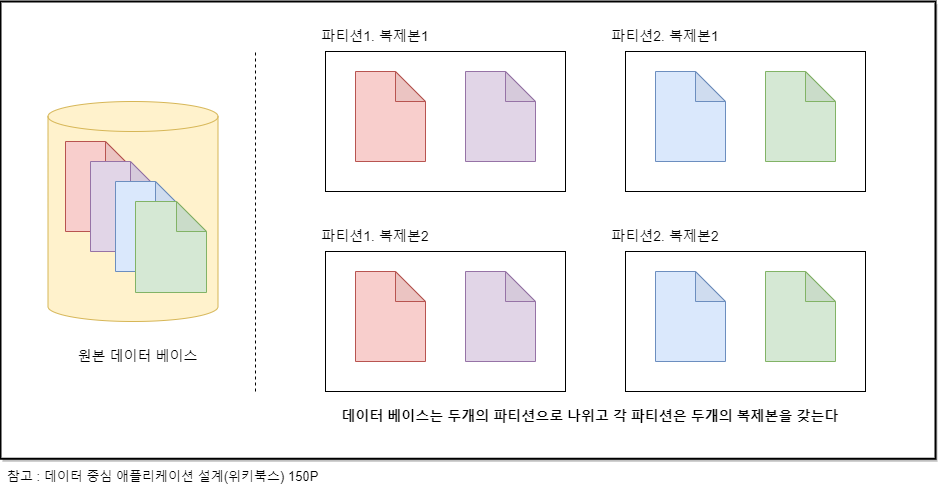

## 복제와 파티셔닝

여러 노드에 데이터를 분산하는 방법은 일반적으로 두 가지가 있다.

- 복제란?
  분산된 데이터 베이스 관점에서 복제란 네트워크로 연결된 여러 노드에 동일한 데이터의 복사본을 유지한다는 의미이다.
- 파티셔닝(샤딩)이란?
  데이터 셋이 단일 장비에 보관하기에 클 경우 데이터를 작은 서브셋으로 나누고 각 파티션은 각기 다른 노드에 할당한다는 의미 인다.

복제와 파티셔닝은 별도의 메커니즘이지만 보통 아래처럼 관련이 있다.  

이번장에서는 복제 메커니즘에 대해 살펴보겠다.
아래 내용들은 데이터 셋이 작아서 각 장비에 전체 데이터 셋의 복사본을 보유할 수 있다는 내용을 가정하고 작성되었다.

## 복제

복제로 인해서 얻을 수 있는 이점은 다음과 같다.

- reduce latency: 지리적으로 사용자와 가깝게 데이터를 유지해 지연시간을 줄인다.
- increase availability: 시스템 일부에 장애 발생하더라도 지속적으로 동작할 수 있으므로 가용성을 높인다.
- increase read throughput: 읽기 질의를 제공하는 장비의 수를 확장해 읽기 처리량을 늘린다.

이번장에서 **꼭 이해하고 넘어갈 부분은 1) 리더와 팔로워 방식의 대한 이해 2) 최종적 일관성에 대한 이해 3) 복제의 3가지 접근방식에 대한 이해라고 생각한다.**

## 리더와 팔로워

다중 복제 서버를 사용하면 모든 복제 서버에 모든 데이터가 있다는 사실을 어떻게 보장할 수 있을까?
모든 쓰기는 모든 복제 서버에서 처리되어야 한다. 그렇지 않으면 복제 서버는 더 이상 동일한 데이터를 유지하는 게 아니다.
이 문제를 위한 가장 일반적인 해결책이 리더 기반 복제이다(reader-based replication)

리더 기반 복제란 클라이언트의 읽기 요청은 모든 데이터 데이스가 받을 수 있으나 쓰기 요청은 리더에서만 받아서 처리하는 방법이다.
리더 기반 복제의 쓰기 동작은 다음 순서로 진행된다.

1. 복제 서버 중 하나를 리더로 지정한다. 다른 복제 서버는 팔로워라고 한다.
2. 클라이언트에게 쓰기 요청이 오면 리더에게 보내고, 리더가 먼저 로컬 저장소에 새로운 데이터를 저장한다.
3. 리더가 새로운 데이터를 기록할 때마다 데이터 변경을 복제 로그나 변경 스트림의 일부로 팔로워에게 전송한다.
4. 팔로워가 리더로부터 로그를 받아 리더의 처리 순서와 동일하게 쓰기 작업을 적용한다.

클라이언트의 **읽기 요청은 리더 또는 임의 팔로워에게 질의할 수 있다. 그러나 쓰기는 리더에게만 적용된다.**
클라이언트에게 팔로워 데이터 베이스는 읽기 전용이다.

:::info 단어 설명

- 리더 팔로워 복제는 마스터-슬레이브라는 용어를 사용하기도 하는데. 보통 '원본' '사본'의 개념으로 사용되는 말이었으나 노예제도를 연상된다는 지적이 많으므로 사용을 자제하는 추세이다. 깃 헙 브랜치 이름이 master -> main으로 바뀐 이유와 같은 이유이다.
- 리더(마스터/프라이머리 등 사용) , 리더 기반 복제(능동/수동, 마스터/슬레이브 등 사용)
- 복제 서버(replica) : 데이터베이스의 복사본을 저장하는 각 노드

:::

리더와 팔로워의 세부 동작 방식에 대해 살펴보자.

### 1. 동기식 대 비동기식 문제

복제 시스템의 중요한 세부 사항은 복제가 동기식으로 발생하는지 비동기식으로 발생하는지 여부이다.

여기서 동기 비동기는 의미는 클라이언트가 리더에게 쓰기 요청을 보낸 후 리더가 클라이언트에게 작업의 결과를 응답하는 시점과 관련이 있다.
리더는 쓰기 요청을 받으면 팔로워에게 변경을 알린다.
동기식 복제는 리더가 팔로워가 쓰기를 수신했는지 확인한 후 클라이언트에게 응답하는 방식이고 비동기식 복제는 팔로원의 OK메시지를 기다리지 않고 바로 클라이언트에게 응답하는 방식이다.

동기식 복제의 장점은 팔로워와 리더가 일관성 있게 최신 데이터 복사본을 가지는 것을 보장하는 것이다. 그러나 단점은 동기 팔로워가 응답하지 않는다면 쓰기 요청이 처리되지 않는다. 동기 복제 서버가 다시 정상화될 때까지 기다려야 한다. 그렇기에 모든 팔로워가 동기식인 상황은 비현실적이며 보통 데이터베이스에서 동기식 복제를 사용할 때는 팔로워 하나는 동기식으로 하고 그밖에는 비동기식으로 하는 것을 의미한다.
이것은 적어도 두 노드에 데이터 최신 복사본이 있다는 것을 보장하며 이런 설정을 반동기식이라고 한다.

동기식의 장점을 설명했지만 보통 리더 기반 복제는 완전히 비동기식으로 구성한다. 이 경우 리더가 잘못되고 복구할 수 없을 때 아직 팔로워에 복제되지 않은 모든 쓰기는 유실된다.
그러나 완전 비동기식 설정은 모든 팔로워가 잘못되더라도 리더가 쓰기 처리를 계속할 수 있다는 장점이 있다.

완전 비동기식 복제는 내구성을 약화시키기 때문에 나쁜 트레이드 오프라 생각할 수 있지만 많은 팔로워가 있거나 지리적으로 분산되어 있다면 비동기식 복제를 널리 사용하고 있다. 이것은 복제 지연 문제와 관련되어 있는데 뒷부분에서 자세히 설명한다.

### 2. 새로운 팔로워 설정

복제 서버 수를 늘리거나 장애 노드의 대체를 위해 새로운 팔로워를 설정해야 할 때가 있다.
새로운 팔로워가 리더의 데이터 복제본을 정확히 가지고 있는지는 어떻게 보장할 수 있을까?

데이터는 항상 유동적이기 때문에 단순한 노드에서 노드로의 파일 복사는 결과가 유효하지 않을 수 있다.
데이터 베이스를 잠그고(lock을 걸고) 노드를 복사하면 쉽게 해결할 수 있을지도 모르나. 고가용성이라는 목표에는 부합하지 않는다.

중단시간 없이 새로운 팔로워 설정하는 개념적인 방법은 다음과 같다.

1. 리더의 데이터베이스의 스냅숏을 일정 시점에 가져온다.
2. 스냅숏을 새로운 팔로워 노드에 복사한다.
3. 팔로워는 리더에 연결해 스냅숏 이후 발생한 모든 데이터 베이스 변경을 요청한다.
4. 팔로워가 스냅숏 이후의 데이터 미처리분(backlog)를 모두 처리했을 때 따라잡았다고 말하고, 이후부터 리더에게 발생하는 데이터 변화를 이어서 처리할 수 있다.

물론 실제 과정은 데이터베이스마다 크게 다르다.

### 3. 노드 중단 처리

시스템의 모든 노드는 장애로 혹은 계획된 유지보수로 인해 중단될 수 있다.
개별 노드의 장애에도 전체 시스템이 정상 작동하고 노드 중단의 영향을 최소화할 수 있어야 한다.
리더 기반 복제에서는 고가용성은 어떻게 달성할 수 있을까?

장애는 두 가지로 나누어질 수 있다.

- 팔로워 장애 : 따라잡기 복구  
  각 팔로워는 리더로부터 수신한 데이터 변경 로그를 로컬 디스크에 보관한다.
  팔로워 장애 복구는 간단하다. 자신에게 결함이 발생하기 전에 처리한 마지막 트랜잭션을 알아낸 후 팔로워는 리더에게 연결이 끊어졌던 동안 발생한 데이터 변경을 모두 요청한다.
  해당 변경사항이 다 적용돼서 리더를 따라잡은 후에 이전과 같이 데이터 변경 스트림을 계속 받는다.
- 리더 장애 : 장애 복구  
  리더의 장애를 처리하는 일은 까다롭다. 보통 아래의 절차를 따른다.

  1. 팔로워 중 하나를 새로운 리더로 승격해야 하고
  2. 클라이언트는 새로운 리더에게 쓰기 요청을 전송하기 위해 재설정이 필요하면
  3. 다른 팔로워는 새로운 리더로부터 데이터 변경을 소비해야 한다.

위 과정을 장애 복구(failover)라 한다.

장애 복구는 수동 혹은 자동으로 진행하는데 자동 장애 복구는 다음과 같은 단계를 거친다.

1. 리더가 장애인지 판단한다 : 장애의 원인을 파악할 방법 없기 때문에 대부분은 타임아웃을 사용한다.
   (판단은 하트비트? 사용 노드들이 서로 메시지 주고받으며 일정 시간 동안 노드 응답 없으면 죽은 것으로 간주)
2. 새로운 리더를 선택한다: 가장 적합한 후보는 보통 이전 리더의 최신 데이터 변경사항을 가진 복제 서버 모든 노드가 새 노드의 동의를 구하는 합의 문제는 이후 일관성 합의에서 자세히 다룬다.
3. 새로운 리더 사용을 위해 시스템을 재설정한다 : 클라이언트가 쓰기 요청 새로운 리더에게 보내야 하며, 시스템이 이전 리더가 팔로워 되고 새로운 리더 인식하게끔 설정

그러나 자동 장애 복구 과정은 문제점이 많다.
비동기 복제 사용 시 이전 리더가 가지고 있던 쓰기의 일부가 수신되지 못한 경우는 어떻게 처리할 것인가?
리더가 죽었다고 판단하는 적절한 타임아웃은 어느 정도 인가? 또한
특정 결함 시나리오에서는 두 노드가 자신이 리더라고 믿는 상황이 올 수 도 있다.

이런 이유로 일부 운영팀은 자동 장애 복구를 지원해도 수동으로 장애 복구를 수행하는 방식을 선호하기도 한다.

## 복제 지연과 최종적 일관성

복제는 내결함성에만 필요한 것이 아니라 확장성(단일 서버에서 감당 못하는 요청)과 지연시간(지리적 가까운 위치) 관점에서도 중요하다.
리더 기반 복제는 쓰기는 리더를 거쳐야 하지만 읽기는 어떤 복제 서버에서도 가능하다. 대부분이 읽기 요청이고 작은 비율의 쓰기 요청이 있는 작업 부하(웹상의 공통 패턴이다)라면 읽기 요청을 분산할 수 있기에 리더 기반 복제는 매력적이다.
이런 읽기 확장 아키텍처는 실제로는 비동기에서만 동작한다. 동기식으로 팔로워에 복제를 시도하면 노드 장애나 네트워크 중단으로 전체 시스템의 쓰기가 불안정해진다. 특히 노드가 많아지면 다운될 가능성도 커진다.

그러나 비동기 팔로워에서 데이터를 읽을 때도 팔로워가 뒤쳐진다면 지난 정보를 볼 수 도 있다.
이 상황은 데이터 베이스와 명백한 불일치이다. 또한 동시에 리더와 팔로워에 동일한 질의를 보내더라도 모든 쓰기가 팔로워에 반영되지 않았기 때문에 서로 다른 결과를 얻을 수 있다.
하지만 **이런 불일치는 일시적인 상태에 불과하며 데이터 베이스에 쓰기를 멈추고 잠시 동안 기다리면 팔로워는 결국 따라잡고리더와 일치하게 된다. 이런 효과를 최종적 일관성이라고 한다.**

일반적으로 리더에 일어난 쓰기와 팔로워에서 반영 사이의 지연은 눈에 띄지 않는 아주 짧은 순간이지만 시스템이 가용량 근처에서 동작하거나 네트워크 문제가 있다면 지연은 수초 수분이 될 수 있다,

이렇게 애플리케이션에서 지연시간이 매우 커지면 불일치는 실제 문제가 된다. 아래에서
복제 지연이 있을 때 발생할 수 있는 3가지 사례와 해결법을 살펴보자.

### 1. 첫 번째 사례 : 자신이 쓴 내용 읽기

사용자가 쓰기를 수행한 직후 데이터를 본다면 새로운 데이터는 아직 복제 서버에 반영되지 않았을 수 있다. 이것은 사용자에게 제출했음에도 유실된 것처럼 보여 불만족스러운 동작이다. 이 경우에는 쓰기 후 읽기 일관성(자신의 쓰기 읽기 일관성)이 필요하다.
**쓰기 후 읽기 일관성은 사용자가 페이지를 재 로딩했을 때 항상 자신이 제출한 모든 갱신을 볼 수 있을 을 보장한다.**

리더 기반 복제 시스템에서는 쓰기 후 일기 일관성을 다양한 기법으로 구현하는데 몇 가지 언급하자면

- 사용자가 수정한 내용을 읽을 때는 리더에서 읽는다:
  자신의 프로필은 리더에서 타인의 프로필은 팔로워에서 읽은 기법이다.
  애플리케이션 내 대부분의 내용을 사용자가 편집할 가능성이 있다면 이 접근 방식은 대부분의 리더에서 읽기 때문에 효율적이지 않다.
- 마지막 갱신 시각을 찾아서 마지막 갱신 후 1분 동안은 리더에서 모든 읽기 수행한다. 혹은 리더보다 모니터링 통해 1분 이상 늦는 모든 팔로워에 대한 질의를 금지한다.
- 클라이언트가 가장 최근 쓰기 시간 기억할 수 있다면 복제 서버가 최소한 해당 시간까지 갱신하도록 대기하거나, 다른 복제 서버가 처리하도록 한다.

### 2. 두 번째 사례: 사용자의 시간이 거꾸로 흐른다

이 사례는 사용자가 각기 다른 복제 서버에서 여러 읽기를 수행할 때 발생할 수 있다.
첫 번째 질의를 한 팔로워보다 두 번째 질의를 한 팔로워가 더 이른 시점에 시스템을 보고 있을 때(복제가 지연됐을 때)
사용자는 데이터를 보고 다시 사라지게 돼서 혼란스러울 것이다.
단조 읽기(monotonic read)는 이런 종류의 이상현상이 발생하지 않음 을 보장한다.
**단조 읽기는 강한 일관성보다는 덜하지만 최종적 일관성보다는 더 강한 보장이다. 한 사용자가 여러 번에 걸쳐 데이터를 읽어도 시간이 되돌아가는 현상을 보지 않는다.**
단조 읽기를 달성하는 한 방법은 각 사용자의 읽기가 항상 동일한 복제 서버에서 수행되게끔 하는 것이다.
예를 들어 임의 선택보다는 사용자 id의 해시를 기반으로 복제 서버를 선택한다. 만약 복제 서버가 고장 난 다면 사용자 질의를 다른 복제 서버로 라우팅 할 필요가 있다.

### 3. 세 번째 사례 : 인과성 위반

A: 이 사과 누가 먹었니?  
B: 제가 먹었어요.

이 두 문장 사이에는 인과성이 있다.
이런 대화가 있을 때 팔로워를 통해 이 대화를 듣고 있는 제3 관찰자가 있다고 해보자.
B는 지연시간이 거의 없이 팔로워에 전달됐지만 A는 아주 긴 복제 지연이 있었다.

그러면 관찰자는 대화를 아래와 같이 듣게 된다.

B: 제가 먹었어요.  
A: 이 사과 누가 먹었니?

이런 종류의 이상현상을 방지하려면 일관된 순서로 읽기(Consistent Prefix Read) 같은 유형의 보장이 필요한다.

**일관된 순서로 읽기는 일련의 쓰기가 특정 순서로 발생한다면 이 쓰기를 읽는 모든 사용자는 같은 순서로 쓰인 내용을 보게 됨을 보장한다.**

이는 파티셔닝 된 데이터 베이스에서 발생하는 특징적인 문제이다. 많은 분산 데이터 베이스에 서로 다른 파티션은 독립적으로 동작하므로 쓰기의 전역 순서는 없다.
한 가지 해결책은 서로 인과성이 있는 쓰기가 동일한 파티션에 기록되게끔 하는 방법이다.
하지만 일부 애플리케이션에서는 효율적이지 않다.

:star: 3가지 일관성에 대한 이슈를 살펴보았다. 결국 복제 지연의 해결책은 복제가 비동기식으로 동작하지만 동기식으로 동작하는 척하는 것이다.

## 단일리더 복제(single-leader)

위에 설명들의 베이스가 된 것처럼 리더가 하나만 존재하는 것을 단일 리더 복제라고 한다.
이러한 리더 기반 복제에는 주요한 단점 하나가 있는데 어떤 이유로 리더에 연결할 수 없다면 데이터 베이스에 쓰기를 할 수 없다.

## 다중리더 복제(multi-leader)

리더 기반 복제 모델은 쓰기를 허용하는 노드를 하나 이상 두는 것으로 자연스레 확장된다.
이 방식을 다중 리더 설정이라 부른다(마스터/마스터 액티브/액티브 복제라고도 함)
이 방식에서 각 리더는 동시에 다른 리더의 팔로워 역할 도 한다.

- 다중 리더 사용 사례

  - 다중 데이터 센터 운영
  - 오프라인 작업을 하는 클라이언트
  - 협업 편집

- 쓰기 충돌 다루기  
  다중 리더 복제에서 제일 큰 문제는 쓰기 충돌이 발생한다는 점이다.
  사용자가 동시에 동일한 부분을 변경한다면 각 변경은 로컬 리더에 성공적으로 적용되지만 변경을 비동기로 복제할 때 충돌을 감지한다.
  충돌을 처리하는 제일 간단한 전략은 충돌을 피하는 것이다. 예를 들어 같은 데이터를 편집할 수 있는 애플리케이션 사용자의 요청을 동일한 데이터 센터로 라우팅 하는 등의 방법을 사용한다. 더 깊은 내용은 책을 참조하기 바란다.

## 리더없는 복제(leaderless)

리더 없는 복제란 지금까지의 리더-팔로워 개념을 버리고 모든 복제 서버가 클라이언트로부터 쓰기를 직접 받을 수 있게 허용한다. 작동방식을 간략하게 설명하자면
클라이언트는 **각 쓰기를 여러 노드로 전송한다. 만약 3개의 노드로 쓰기 요청을 보냈는데 2개의 복제 서버가 쓰기를 확인하면 충분하다고 가정한다.**
클라이언트는 나머지 복제 서버 하나가 쓰기를 놓친 사실은 무시하고 두 개의 ok응답을 받았다면 쓰기가 성공한 것으로 간주한다. 그 후 클라이언트가 해당 데이터를 읽을 때 해당 노드에서 값을 얻는다면 오래된(outdated) 값을 얻을 수 있다. 이 문제를 해결하기 위해 클라이언트가 데이터를 읽을 때 하나의 복제 서버로 요청을 보내지 않고 **읽기 요청을 병렬로 여러 노드에 전송한다.**
그러면 클라이언트는 여러 노드에서 다른 응답을 받을 수 있다, 즉 한 노드에서는 최신 값을 다른 노드에서는 오래된 값을 받는다. 이때 버전 숫자를 사용해 어떤 값이 최신 내용인지 결정하는 방식이다.
