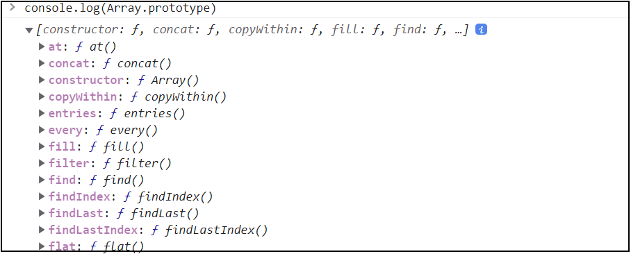
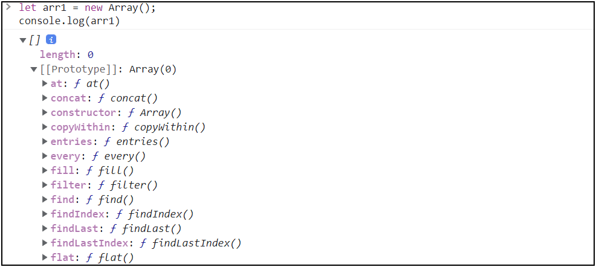
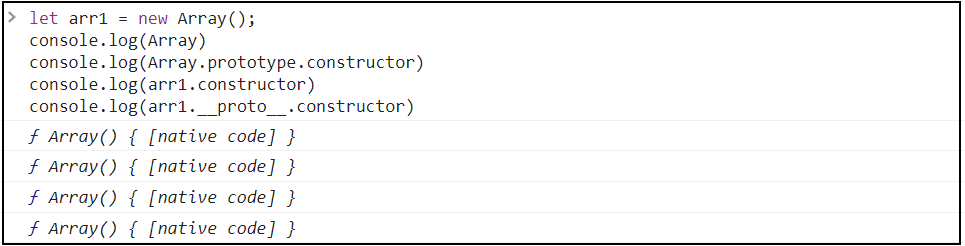
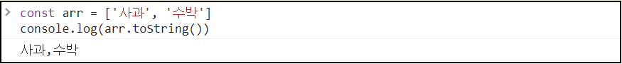
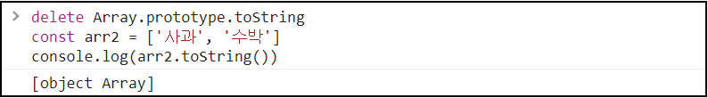

::: tip GOAL
Q. 자바스크립트 프로토타입이란?  
:::
해당페이지는 2022년 3월 노션에서 마이그레이션 되었습니다.

## prototaype

생성자 함수가 있을 때 new 연산자로 인스턴스를 만들게되면 그 인스턴스 Constructor의 prototype를 해당 인스턴스의 `[[Prototype]]`이 바라보게 된다.즉 `Constructo.prototype`과 `instance.[[Prototype]]`이 같은 객체를 바라보게 된다. 여기서 주의점은 [[Prototype]]은 접근가능한 것이 아니라 정보를 보여주기만 할 뿐이다.

**예시**  
Array 생성자 함수를 출력하면 prototype에 배열 메소드가 다 들어가 있는걸 확인 할 수 있다.
Array 생성자 함수로 배열을 생성한 후, 생성한 배열을 출력하면 생성한 배열에 있는 [[prototype]]에 위와 같은 메소드가 다 들어가 있다.



`Array.prototype.constructor`는 다시 Array 즉 생성자 함수 자신을 가리킨다.
`생성한배열.constructor` 역시 똑같이 배열의 생성자 함수를 가리킨다.
`생성한배열.[[Prototype]].constructor(실제 이렇게 접근x)` 또한 위와 동일하다.
위의 3개 값 모두 Array생성자 함수를 가리키게 된다.  




정리해보면 배열은 Array 생성자 함수와 그 프로토 타입으로 이루어져 있는데 프로토 타입에는 배열과 관련된 메서드들이 모두 들어있다.

그러면 숫자 리터럴은 어떨까? 숫자 리터털 자체는 객체가 아니므로 [[Prototype]] 있을 수 없는데 사용자가 객체로 쓰려고 하면 즉 메서드를 쓰려고 하면 자바스크립트가 임시로 숫자 리터럴에 해달하는 Number생성자 함수 인스턴스를 만들어서 그 Prototype 타입에 있는 메서드를 적용해서 원하는 결과를 얻게 한 다음에 다시 인스턴스를 제거하는 식으로 동작을 한다.

문자열도 마찬가지로 어떤 메서드를 호출하는 순간에 임시로 문자열의 인스턴스를 만들어서 그 메서드를 실행하고 그 결과를 얻음과 동시에 인스턴스를 다시 폐기한다. 기본형 타입의 데이터들은 모두 이같은 방식에 의해 메서드를 호출할 수 있다.

한편 참조형 데이터들은 처음부터 인스턴스이기 때문에 위 같은 복잡한 과정을 거치지는 않는다.
어쨌든 결국 숫자형이든, 문자형이든, 배열이든, 함수든 할 것 없이 모두 메서드에 접근하고자 할때는
모두 아래와 같은 구조가 된다. 생성자 -> 생성자.prototype{method1, method2, method4}

데이터 자신에게는 메서드들이 없지만 생성자들의 prototype에 있는것을 [[Prototype]]라는 연결통로에 의해서 자신의 것처럼 쓸 수 있다.
null과 undefined를 제외한 모든 데이터 타입은 이와 같은 생성자 함수가 존재한다. 각 생성자 함수의 프로토타입에는 각 데이터 타입에만 해당하는 전용메서드들이 정의가 되어있다.

여기서 주의점! [[Prototype]]는 콘솔에 표시가 되는 내용일 뿐이고 실제로 이 프로퍼티를 이용해서 프로토타입에 직접 접근할 수 는 없다.

그렇다면 실제로 인스턴스로 부터 접근하려면 어떻게 하느냐?

```
instance.__proto__  => 호환성차원에서 문사화 해준 것
Object.getPrototypeOf(instance) = > 공식적인 방법
```

위같은 방법 2개가 있다 공식적인 `Object.getPrototypeOf(instance)`를 사용하는게 좋다.

```
function Person(n, a){
  this.name = n;
  this.age = a;
}

var roy = new Person('로이',30);

var royClone1 = new roy.__proto__.constructor('로이_클론1',10);

var royClone2 = new roy.constructor('로이_클론2',25);

var royClone3 = new Object.getPrototypeOf(roy).constructor('로이_클론3',20);

var royClone4 = new Person.prototype.constructor('로이_클론4',15)
```

여기 보이는 roy 와 roy Clone 은 다 Person의 인스턴스가 된다 . 다 동일한 프로토타입에 접근할 수 있게 된다.

```
[prototype 접근 방법]
instance.__proto__

instane

Objcet.getPrototypeOf(instance)

Constructor.prototype
```

위 4가지 방식에 의해서 생성자 함수의 prototype이라고 하는 프로퍼티에 접근이 가능하다.
또한 이것들은 모두 동일한 함수 Person이라고 하는 생성자 함수를 가리킨다.

```
[Constructor 접근 방법]

instance.__proto__.constructor

instane.constructor

Objcet.getPrototypeOf(instance).constructor

Constructor.prototype.constructor

```

4가지 방식으로 생성자 함수에 접근할 수있다.


## 메서드 상속 및 동작 원리

```
function Person(n, a){
  this.name = n;
  this.age = a;
}

var roy = new Person('로이',30);
var jay = new Person('제이',30);

roy.setOlder = function(){
  this.age += 1;
}

roy.getAge = function(){
  return this.age;
}

jay.setOlder = function(){
  this.age += 1;
}

jay.getAge = function(){
  return this.age;
}

```

Person 생성자로부터 roy객체 그리고 jay라고 하는 객체 두개의 인스턴스를 만들었는데
둘의 함수가 같다. 이럴땐 DIY하지말고 DRY(드라이,Don't Repeat Yourself, 최대한 반복을 줄여라)하라고 말을 한다. 아래와 같이 리팩토링 할 수 있다. 

```
function Person(n, a){
  this.name = n;
  this.age = a;
}
Person.prototype.setOlder = function(){
  this.age += 1;
}

Person.prototype.getAge = function(){
  return this.age;
}

var roy = new Person('로이',30);
var jay = new Person('제이',30);

```

인스턴스들은 한번만 만들어놓은 Person의 메서드를 참조할 수 있게 된다.
인스턴스들은 저마다의 고유한 정보들'만' 가지고 있으면 되고,
인스턴스들이 모두 똑같이 가지는 정보들은 prototype으로 보내면 된다.
그럼에도 각 인스턴스들은 마치 자신의 메서드인 것처럼 다양한 명령 수행할 수 있다.
즉 메모리 사용효율을 상당히 끌어 올릴 수 있다.

객체지향점 관점에서 봐도 객객인의 이름,나이 등의 특징은 다 다르지만
사람은 모두 나이를 먹고(setOlder), 각자의 나이를 알 수 있다.(getAge) 라고 하는
일반화 시켜진 이런 특징들은 프로토타입으로 설명할 수 있다.

## 프로토타입 체이닝 Prototype Chaining

프로토타입 프로퍼티 역시 객체이다. 프로토타입 프로퍼티 역시 object 생성자 함수의 new 연산으로 생성된
인스턴스라는 말이 되며 따라서 Object의 prototype 과 연결이 되어 있다. 그러니까 인스턴스는 Object.prototype에 있는 메서드도 자신의 것처럼 사용할수 있다. 연결되어 있는 프로토타입들을 일컬어 프로토 타입 체인이라고 부른다. 프로토 타입은 객체이므로 모든 데이터 타입은 한결같이 이와 동일한 구조를 따른다.

숫자형이든, 문자형이든, 배열이든, 함수든.Object.prototype과 프로토타입 체인으로 연결되어 있다.
Object.prototype 에는 자바스크립트 전체를 통괄하는 공통된 메서드들 즉 hasOwnProperty(), toString(),
valueOf(), isPrototypeOf() 등의 공통된 메서드들이 정의되어 있다. 이는 모든 데이터 타입이 프로토 타입 체이닝을 통해 접근할수 있다.
그렇기 때문에 객체 프로토타입에는 '객체'전용 메서드들을 정의 해둘 수가 없다.

그래서 어쩔 수 없이 전용메서드를 Object.prototype에 정의하는 것을 포기하고 객체 생성자 함수에 직접 메서드를 정의할수밖에 없었다. 유독 객체관련 명령어 들은 객체로 부터 직접 메서드를 호출하는 대신에
Object.명령어를 호출하면서 그 매개변수로 객체 자신을 넘겨주는 방식을 취하는 경우가 많은 이유가 바로 이 프로토타입 체인 때문이다

```
Object.freeze(obj)
Object.keys(obj)
Object.values(obj)
```


**예시**  
* `배열.to String()`하면 아래와 같이 이쁘게 출력된다.   
 

* `Array.prototype.toString` 이걸 delete로 지우고 
[1,2,3].to String(); 하면 `[object Array]`이 출력된다.  




프로토 타입 체인을 타고서 `Object.prototype.toString()`이 호출되었기 때문이다. 이것도 지우면 관련 메서드가 없다고 오류를 던진다.

메서드에 명령내리면 아래 과정을 거친다.  
1. 메서드를 자기 자신에게서 먼저 찾고  
2. 없으면 Array.prototype에서 찾고 있으면 호출  
3. 여기도 있으면 호출 없다면  올라갈수있는 체인까지 탐색하다가 없으면 에러  
   가장 먼저 발견한 메서드를 실행한다.

스코프체인이랑 개념이 같다. 가장 먼저 자기자신부터 찾고 가장 먼저 찾아진 메서드만 실행하고 그보다 더 멀리 있는 체인까지는 찾아가지 않는다.

## 최종 결론
인스턴스에는 메서드가 없음에도 불구 하고 [[prototype]]이라는 매개체 덕분에 생성자 함수의 prototype에 있는 메서드를 자신의 것처럼 쓸 수 있다. 또한 [[prototype]] 으로 이어진 각 prototype 들에 모두 접근할수있는 것을 일컬어 프로토 타입 체인이라고 한다.

## Reference

[코어 자바스크립트(인프런)](https://www.inflearn.com/course/%ED%95%B5%EC%8B%AC%EA%B0%9C%EB%85%90-javascript-flow/dashboard)
