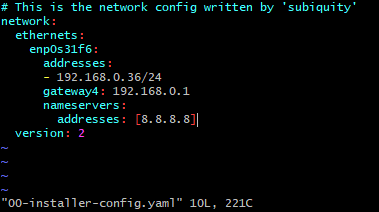

---
index: 4
icon: creative
title: Ubuntu 고정 IP 변경
category:
  - linux
date: 2022-04-06
editLink: false
--- 
 
>  Ubuntu Server 20.04 기준으로 작성되었습니다.  

우분투 고정 IP 변경시 설정 파일 하나만 수정해 주면 된다.  
네트워크 설정 파일은 /etc/netplan 디렉토리 안에 있는 00-installer-config.yaml 파일이다. 파일이름이 다를 수도 있는데 해당 경로 안에 있는 yaml 파일을 열면 된다.  

`sudo vi /etc/netplan/00-installer-config.yaml`

해당 파일을 열면 아래와 같은 내용이 작성되어 있는데 해당 부분의
addresses 부분을 바꾸고자 하는 ip로 수정한다.
고정 IP뿐만 아니라 다른 네트워크 설정도 해당 파일에서 수정하면 된다.  

수정 완료 후 netplan apply 명령어를 입력해주면 변경사항이 적용된다.

`sudo netplan apply`
