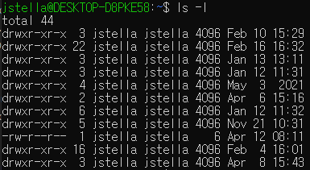

==자주 검색하는 명령어 저장해 놓기==

## 디스트 남은 용량 확인(df)

**df .** : 현재 디렉토리가 포함된 파티션의 남은 용량을 확인  
**df -h** : 단위 정리해서 깔끔하게 보여 줌  
**df -k** : kb 단위로 남은 용량확인  
**df -m** : mb 단위로 남은 용량확인

## 현재 디렉토리에서 서브디렉토리까지의 사용량 확인(du)

**du -s** : 총 사용량을 확인  
**du -sh \*** : 현재 경로 아래 사용량 확인, 1depth  
**du -a** : 현재 디렉토리 아래로 파일단위로 사용량 확인  
**du -h** : 단위 정리해서 깔끔하게 보여 줌

## 리눅스 서버간 파일 복사(scp)

- 현재 서버에서 다른서버로 파일 복사  
  `scp 파일명 계정@서버주소:목적경로`
  `scp ./log.txt userA@192.168.0.36:/home/logs`

  현재 내 서버의 log.txt 란 파일을 `192.168.0.36` 서버의`/home/logs` 경로로 이동시킨다.
  목표 서버의 사용자 이름은 userA이다. ssh 접속 설정이 되어있으면 해당명령어를 치면 비밀번호 입력창이 나온다.

- 현재 서버로 다른서버의 파일 복사

  로컬 경로와 원격 경로를 반대로 입력해서 실행하면 된다.  
  `scp 계정@서버주소:원본경로 목적파일명`  
  `scp userA@192.168.0.36:/home/logs/logs /mylogs`

- 옵션  
   디렉토리 복사시 scp 뒤에 -r 옵션을 추가 해주면 된다.  
   `scp -r /mylogs ... `  
  포트 번호를 붙여야 할 시 [-P 포트번호] 옵션을 추가 해주면 된다.  
  `scp -p 3010 -r /mylogs ... `

## 권한 바꾸기(chmod)

리눅스 파일은 user, group, others 별로 read, write, execute 권한을 부여할 수 있다.  
`ls -l` 명령어를 통해 현재 파일에 부여되어 있는 권한을 확인하면  
  
\*맨앞의 d 와 - 는 directory이냐 file를 구분

rwxrwxrwx로 권한을 나타내는데

앞에 3개가 **user** 즉 **소유자(owner)**의 권한이고,
중간에 3개는 **group** 에 대한 권한
마지막 3개가 **others** 에 대한 권한이다.

8진수로 표현시 r=4,w=2,x=1로 로 표현해서 나타낸다.  
ex) 700 : user에게만 모든 권한부여, 644: user에게는 read, write 권한 group, others에게는 read 권한만 부여

+, - 기호를 사용해서 특정 권한을 더하거나 뺄 수도 있다.

예시  
`chmod 744 test.txt`  
`chmod g+r test.txt`  
`chmod o-rwx test.txt`

## 명령어 연산자(; , &&, &)

- ; - 앞의 명령어가 실패해도 다음 명령어가 실행
- && - 앞의 명령어가 성공했을 때 다음 명령어가 실행
- & - 앞의 명령어를 백그라운드로 돌리고 동시에 뒤의 명령어를 실행

## systemctl

**enable** : 시스템이 재부팅하면 자동으로 서비스 실행

ex ) `sudo systemctl enable mongod`

**disable** : enable한 서비스 해제

**status** : 서비스 상태 확인
