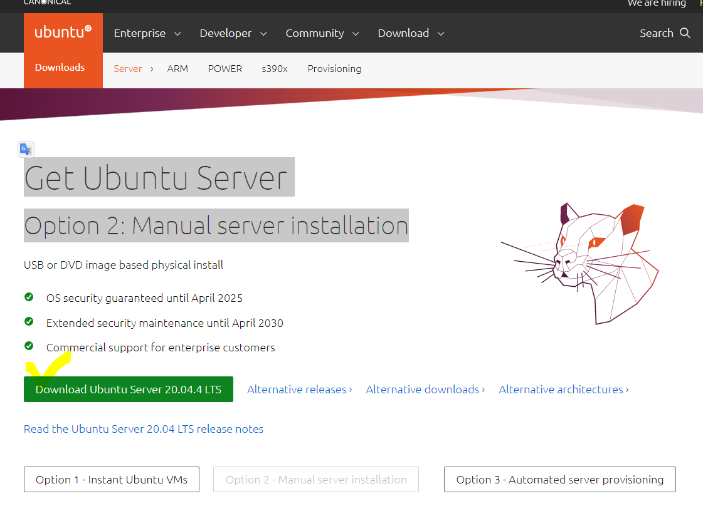
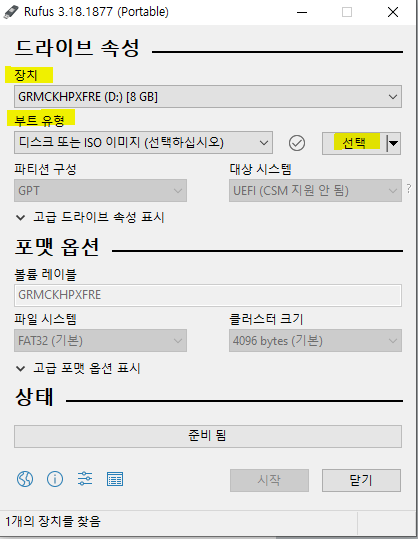
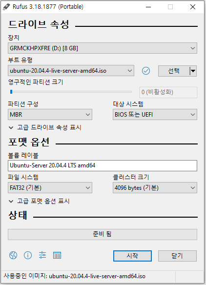

Ubuntu Server를 설치하기 위해서는 먼저 부팅 가능한(bootable)한 설치 USB를 만들어야한다. 준비물은 2GB이상의 USB가 필요하다. 설치 USB는 그 내용이 모두 지워지기 때문에 메모리가 다 비워진 USB를 준비한다.

## 1. 우분투 리눅스 설치 파일 다운로드

우분투 리눅스 홈페이지([https://ubuntu.com/download/server](https://ubuntu.com/download/server))에서 Ubuntu Server를 다운로드한다.
2022.04.06기준 LTS로 출시된 가장 최신의 우분투 리눅스 버전은 "20.04.4 LTS"이다.  

## 2. 부팅가능한 설치 USB 만들기

리눅스를 설치할 때는 단순히 파일을 복사하는 것이 아닌 PC의 부트시스템이 실행할 수 있는 형태의 데이터를 만들어야 한다(**bootable)**. 우분투에서 권장하는 "Rufus USB installer" 툴을 사용하여 설치 USB를 만들어보자. 먼저 준비된 USB를 컴퓨터에 연결한 후  
[Rufus 다운로드]("https://rufus.akeo.ie/") 해당 링크를 클릭하여 프로그램을 다운로드하고 실행시킨다.

- 장치에 설치 할 USB를 선택한다.
- 부트유형의 선택 탭을 클릭하여 다운받은 리눅스 설치파일을 선택한다.
- 그러면 아래와 같이 화면이 갱신된다. 시작버튼을 누르고 나오는 창들에 다 확인 버튼을 누르면 설치 USB 만들기를 시작한다.

## 3. 설치 USB로 PC에 우분투(UBUNTU) 리눅스 설치하기.

설치 USB를 만들었다면 PC가 전원이 꺼진 상태에서 USB를 연결시키고 PC를 시작한다.
만약 USB가 부팅 우선 순위에서 1순위가 아니면, 설치 USB가 실행되지 않으므로 이 경우에는
자신의 메인보드에 맞는 바이오스(BIOS) 진입 키(나의 경우 DEL키 or F2)를 이용해 BIOS 설정에 진입해서 부팅 우선순위를 USB로 바꿔준다.

## 참고

https://recipes4dev.tistory.com/112
