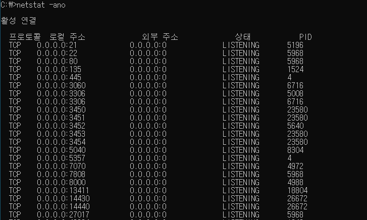
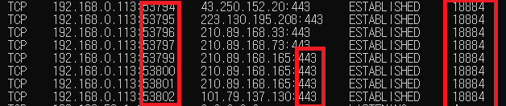
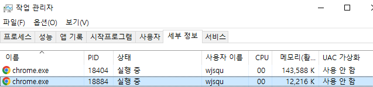

:::tip GOAL

- 4계층에서 하는 일
- 4계층 프로토콜의 종류
- 포트번호의 특징
- well-know 포트란?
  :::
  해당페이지는 2022년 3월 노션에서 마이그레이션 되었습니다.

## 4계층 기능

- 4계층에서 하는 일
  전송계층(Transport layer)은 송신자의 프로세스와 수신자의 프로세스를 연결하는 통신 서비스를 제공한다.
  전송계층은 연결지향데이터 스트림 지원, 신뢰성, 흐름제어, 그리고 다중화와 같은 편리한 서비스를 제공한다.
  전송 프로토콜 중 가장 잘 알려진 것은 연결 지향 전송 방식을 사용하는 전송제어 프로토콜(TCP)이다. 보다 단순한 전송에 사용되는 사용자 데이터그램프로토콜(UDP)도 있다.

- 4계층 프로토콜의 종류
  TCP : 연결 지향 전송 방식을 사용하는 전송제어 프로토콜, 연결확인하고 보낸다. 과정이 복잡하다
  UDP : 비연결지향 전송방식을 사용한다. 일단 보낸다. 과정 단순하다.

## 포트번호

- 포트번호의 특징
  특정 프로세스와 특정 프로세스가 통신을 하기 위해 사용한다.
  하나의 포트는 하나의 프로세스만 사용 가능하다.
  하나의 프로세스가 여러 개의 포트를 사용하는 것은 가능하다.
  포트 번호는 일반적으로 정해져 있지만 무조건 지켜야 하는 것은 아니다.
  예를 들어 일반적으로 웹 서비스는 80번 포트를 사용하지만 웹 서비스가
  항상 80번 포트를 사용해야만 하는 것은 아니다.
  0~65535 번까지 있다. 3가지로 분류 할 수 있다.

  \*프로세스 : 메모리에서 동작중인 프로그램

- well-know 포트
  전세계적으로 유명한 포트번호
  | 서비스 이름 | 포트번호|
  |--|--|
  |FTP |20번 21번|
  |SSH |22번|
  |TELNET |23번|
  |DNS |53번|
  |DHCP |67번, 68번|
  |TFTP |69번|
  |HTTP / 웹서비스 |80번|
  |HTTPS |443번|

- Registered 포트  
  공신력있는 애들이 사용하겠다고 등록해 논 포트번호 1024~ 49000정도 포트
  | 서비스 이름 | 포트번호|
  |--|--|
  |오라클 DB서버 |1521|
  |MySQL|3306번|
  |Ms 원격 데스크 탑 |3389|

- Dynamic 포트
  일반사용자들이 사용하는 포트, 특정 서버에 접속하는 사용자들이 사용하는 포트번호

  | 시작포트번호 | 마지막포트번호 |
  | ------------ | -------------- |
  | 49152번      | 65535번        |

  ex. 내가 네이버 80번 웹서버에 접속을 하려고
  크롬이라는 프로그램을 쓸 때, 크롬이라는 프로그램이 네이버 웹서버랑 연결이 될때 저 중에 포트번호 하나 써서 연결해서 데이터 주고 받는다.

  결국 우리가 웹,인터넷을 사용하면 포트번호, IP주소, 2계층 mac 주소 이 3개를 다 사용해야 한다.

## 프로그램의 연결정보

`netstat -ano`로 확인

현재 포트 활성여부를 나타내는 활성 연결 테이블

## 실습

- 특정 서비스의 포트번호 확인하기

1. 먼저 크롬을 이용해 네이버 들어간후 cmd창에사 `netstat -ano` 하면  
   
   443번 포트번호의 네이버 서버와 나의 50000~번대 포트들이 연결되어 있고 실행중인 프로그램 PID는 18884다.
2. 작업관리자로 해당 프로그램 확인해보면 크롬이다
   
   내 컴퓨터에 크롬이라는 프로그램과 위에 활성연결테이블로 확인한 IP를 쓰고있는 네이버의 서버 컴퓨터에 443번 포트의 프로세스가 연결되서 메인 페이지를 받아온 것이다.

네이버 생략된 포트번호`naver.com:443`

## Reference

[따라하며 배우는 IT - 네트워크 기초(YouTube)](https://www.youtube.com/playlist?list=PL0d8NnikouEWcF1jJueLdjRIC4HsUlULi)
