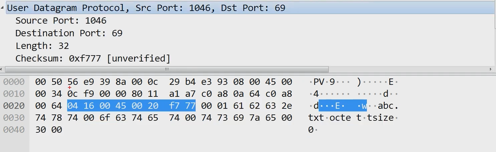

:::tip GOAL
Q.UDP가 하는 일  
Q.UDP 프로토콜의 구조   
Q.UDP 프로토콜을 사용하는 대표적인 프로그램들  
:::
해당페이지는 2022년 3월 노션에서 마이그레이션 되었습니다.  

## UDP 프로토콜 하는 일

굉장히 단순한 전송 방식을 사용하고 있는  비연결지향성 전송방식을 가진 프로토콜이다. 
연결된 상태에서 전송하는게 아니기 때문에 신뢰성이 낮다. 데이터의 도착 순서가 바뀌거나, 중복되거나, 심지어는 통보 없이 누락시킬 수 도 있다. 그러나 단순한 전송방식을 가지고 있기 때문에 TCP보다는 
속도면에서 이득을 가지며 일반적으로 오류의 검사와 수정이 필요 없는 프로그램에서 수행할
것으로 가정한다.

UDP로 데이터 전송하는건 특수한 경우라 볼 수 있다. 동영상 스트리밍 같은경우는 데이터 신뢰성에서 약간의 손해를 봐도 괜찮기 때문에 UDP를 사용할 수 있다. 동영상은 1초에 30-60개의 사진이 후다닥 지나가는 것이기 때문에 그 중에서 사진이 한장 빠졌다해도 큰 문제를 일으키지 않는다. 그렇다고 무조건 동영상 스트리밍 할때 UDP만 쓰는게 아닌 상황에 맞게 혼합해서 사용한다. 

위 정보가 일반적으로 UDP에 대한 기본적인 정보이고 추가적으로 HTTP/3은 UDP기반 전송을 한다! 이부분은  따로 공부가 필요하다.

사용자 데이터그램 프로토콜(User Datagram Protocol, UDP)은 유니버설
데이터그램 프로토콜(Universal Datagram Protocol)이라고 일컫기도
한다.

### UDP 프로토콜의 구조

* 출발지 포트번호(0~65...) 2Byte
* 목적지 포트번호 2Byte
* 길이 : UDP프로토콜+페이로드 길이
* 체크썸 : 헤더프로토콜 손상되지 않았는지 체크하는 값

## UDP 프로토콜을 사용하는 프로그램

UDP 프로토콜을 사용하는 대표적인 프로그램들

* DNS 서버 : 도메인을 물으면 IP주소를 알려주는
* tftp서버 : UDP로 파일을 공유하는
* RIP 프로토콜 : 라우팅 정보를 공유하는

## 실습
1. UDP패킷을 캡쳐해보고 분석해보기

출발지 포트 2Byte  목적지 포트 2Byte, 길이 32Byte(TFTP 24 + 헤더 8), 체크썸으로 이루어져 있다.

## Reference
[따라하며 배우는 IT - 네트워크 기초(YouTube)](https://www.youtube.com/playlist?list=PL0d8NnikouEWcF1jJueLdjRIC4HsUlULi)
