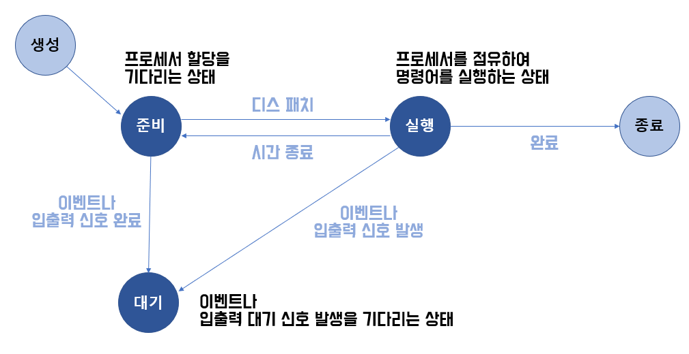
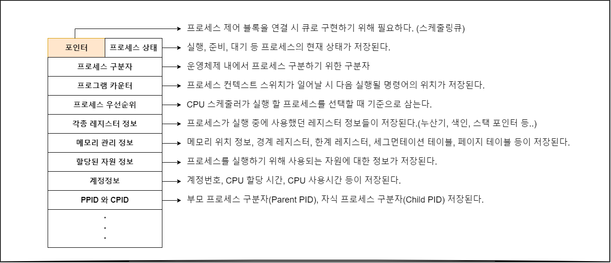

:::tip GOAL
Q. 프로세스란 무엇인가요?  
Q. 프로세스의 메모리 구조를 설명하세요.  
Q. 컨텍스트 스위치와 PCB는 무엇인가요?
:::
해당페이지는 2022년 3월 노션에서 마이그레이션 되었습니다.

## 프로세스의 개념

- 프로세스 :
  - 실행하고 있는 프로그램
  - 디스크에 있던 프로그램을 **메모리에 적재**하여 **운영체제의 제어를 받는 상태**가 되었다.
  - 자신만의 메모리 주소가 있다.
- 프로그램과 프로세스 비교
  - 프로그램은 컴파일한 코드와 초기화 전역변수, 문자열과 문자열 상수 등 정적 데이터를 포함하는 **정적인 개체**이다.
  - 프로세스는 메모리 구조를 이루고 현재 어떤 자원을 사용하는지 관련 정보가 들어 있는 **동적인 개체** 이다.

## 메모리 상에서의 프로세스(프로세스의 메모리 구조)

- 스택 : 데이터를 일시적으로 저장하는 영역이다. 지역변수, 호출한 함수의 반환 주소, 반환 값, 매개변수 등에 사용 한다. 함수를 호출할수록 커지고 반환하면 줄어든다.

- 힙 : 힙은 코드 영역과는 별도로 유지되는 자유 영역이다. 프로그래머가 필요할 때 사용하는 메모리 영역으로 프로그램 실행 중 시스템 호출을 사용하여 동적으로 메모리를 할당했다가 해제하는 방법으로 활용한다. 런타임에 결정

- 데이터 : 전역변수와 정적(static)변수가 저장되는 공간이다. 이 변수들은 프로그램이 시작될 때 할당되어 프로그램 종료 시 소멸된다.
  더 자세히 살펴보면 BSS(Block Stated Symbol) 영역이 있는데 해당 영역에는 초기화 되지 않은 전역변수가 저장된다. 초기화 된 전역변수는 Data 영역에 저장되어 비휘발성 메모리인 ROM에 저장되는데 이 경우 비용이 많이 들어 RAM에 저장될 것과 ROM에 저장될 것을 구분하기 위해 영역을 구분해 사용한다.

- 텍스트(코드) : CPU가 디스크에서 읽어 실행하는 컴파일한 프로그램을 저장한다.(실행할 프로그램의 코드가 저장된다) CPU로 변경 할 수 없다. 즉 이 영역은 컴파일 타임에 결정되며 read-olny이다

스택과 힙은 메모리 크기가 변한다. 보통 스택포인터와 힙 포인터가 만나면 메모리가 소진되었다는 의미이다.

## 프로세스 종류

- 커널 프로세스 vs 사용자 프로세스(프로세스의 역할에 따라)

  - 커널 프로세스 : 모든 시스템 메모리와 프로세서의 명령에 액세스할 수 있는 프로세스이다. 프로세스 실행 순서를 제어하거나 다른 사용자 및 커널영역을 침범하지 않도록 감시하고 사용자 프로세스를 생성하는 기능을 한다.

  - 사용자 프로세스 : 사용자 코드를 수행하는 프로세스이다.

- 독립 프로세스 vs 협력프로세스(병행 수행 방법에 따라)

  - 독립 프로세스 : 다른 프로세스에 영향을 주지 않거나 다른 프로세스의 영향을 받지 않으면서 수향하는 병행 프로세스이다.

  - 협력 프로세스 : 다른 프로세스에 영향을 주거나 다른 프로세스에ㅇ서 영향을 받는 병행 프로세스이다.

## 프로세스 상태 변화

프로세스 상태 : New / Waiting / Running / Ready / Terminated  
운영체제는 프로세스 제어에 필요한 상태를 점검하고 프로세스를 제어한다.  
 

- **준비 -> 실행(dispatch)**  
  준비 큐 맨 앞에 있던 프로세스가 프로세서를 점유하는 것을 디스패치라고 한다.
- **실행 -> 준비(timeout)**  
  운영체제는 한 프로세스가 독점하는 것을 막기 위해 interrupt clock(timer)를 두어 특정 프로세스가 할당된 시간 만큼만 프로세서를 점유하게 한다. 해당 시간이 끝나면 클록이 인터럽트를 발생시켜 운영체제에게 CPU 제어권을 부여한다. 그러면 시간을 전부 소진한 프로세스는 준비상태로 가고 준비큐 맨 앞의 프로세스가 실행상태가 된다.
- **실행 -> 대기(block)**  
  프로세스를 실행하다가 입출력 명령이나 시간이 많이 필요한 이벤트가 발생하면 프로세서를 스스로 반납하고 대기 상태가 된다.
- **대기 -> 준비(wakeup)**  
  대기 상태에서 입출력 작업이 끝나면 대기에서 준비 상태가 된다

## 프로세스 스케줄링

- 프로세스 스케줄링 목적 : CPU 이용을 최대화
- 스케줄링 큐
  - Job queue : 프로세스가 시스템에 들어오면 줄을 서는 큐
  - Ready queue : 준비완료상태에서 실행을 대기 하는 프로세스들이 들어오면 줄을 서는 큐
  - Device queue : 메인큐는 아니지만 특정 입출력 장치를 대기하면서 프로세스가 줄을 서는 큐
- 단기스케쥴러, 중기 스케쥴러, 장기 스케쥴러

## PCB(프로세스 제어블록, Process Control Block)

운영체제가 프로세스를 제어할 때 필요한 프로세스 상태 정보는 프로세스 제어 블록에 저장된다. 프로세스가 생성되면 메모리에 프로세스 제어블록을 생성하고 프로세스가 실행을 종료하면 해당 프로세스 제어 블록도 삭제한다.
프로세스 제어 블록에는 아래와 같은 정보가 들어 있는데 운영체제의 모든 모듈이 이 정보를 읽고 수정할 수 있다.

## 컨텍스트 스위치

- 실행중이던 작업 중간에 다른 작업의 수행이 필요할 때,
  이전 프로세스 상태를 보관, 프로세스 재개시 참조 할 수 있도록 함
- 컨텍스트 복구작업, 다른 프로세스로 교환하는 작업
- PCB에 실행중이던 프로세스 문맥저장
- 컨텍스트 스위치 수행시간은 순수한 오버헤드이다. OS 구성시 고려 필요

## 운영체제에서의 프로세스 생성/종료

- 프로세스는 실행 중에 프로세스 생성 시스템을 호출을 이용하여 새로운 프로세스를 생성할 수 있다. 이때 부모-자식 관계를 유지하여 계층적으로 생성한다.
- 프로세스 생성 :
  - 프로세스가 새로운 프로세스를 생성할 때 다음 두 가지 실행이 발생할 수 있다.
  - 1. 부모프로세스와 자식 프로세스를 동시에 실행한다
  - 2. 부모 프로세스는 자식 프로세스를 모두 종료할 때 까지 기다린다.
- fork() (새로운 프로세스 위한 메모리 할당) , exec() (호출한 프로세스의 PID 새로운 프로세스에 적용, 덮어쓰기) 시스템 콜 통해서 프로세스 생성
- exit() (정상종료) , abort()(비정상 종료 - 좀비 프로세스, 고아프로세스)

## [IPC]공유 메모리와 메세지 전달을 통한 프로세스간 통신

- Interprocess Communication : 여러 프로세스간의 데이터를 주고 받을 수 있도록 하는 메커니즘.
- 프로세스가 협력을 허용하는 환경을 제공하는 이유
  - 정보공유,계산가속화, 모듈성, 편의성
- 공유메모리:

  - 다수의 프로세스에 의해서 공유되는 메모리 영역
  - 통신하는 프로세스들 공유 메모리 영역 구축해서 사용한다.

- 메시지 전달 방식:
  - 동일한 주소공간을 공유하지 않고도 프로세스들이 통신이 가능하고 그 동작을 동기화 할 수 있도록 허용하는 기법
  - 통신하는 프로세스들이 다른 네트워크에 있는 분산환경일 때 유용하다.
  - send / receive 이 두 명령어로 구성된다.
  - 직접 - 간접통신 / 동기식-비동기식 통신/ 자동-명시적 버퍼링
- 비교  
   공유메모리 → 속도 / 메지지 전달 → 구현용이성, 분산환경

## 소켓통신과 원격 프로시져 콜을 통한 client-server 통신

- 원격 프로시져 콜(Remote Procedure call):
  - IPC 방법의 한 종류로 원격제어를 위한 코딩 없이 원격지의 프로세스에 접근하여 프로시저 또는 함수를 호출하여 사용하는 방법
  - 현재에는 MSA(Micro Software Archtecture)에서 많이 사용서로 다른 환경이지만 서비스간의 프로시저 호출을 가능하게 해줌 언어에 구애받지 않고 환경에 대한 확장이 가능하게 해준다.
- 소켓(sorcket) : IP. Port 번호를 조합하여 식별하는 방식
- client-server 아케텍쳐
  - 서버가 특정 포트 리슨하면서 클라이언트 요청 대기, 요청 받으면 서버는 클라이언트 소켓으로부터 연결요청 수락 하는 방식
  - 네트워크로 연결된 서버 상의 프로시져를 원격으로 호출 할 수 있는 기능이다.
