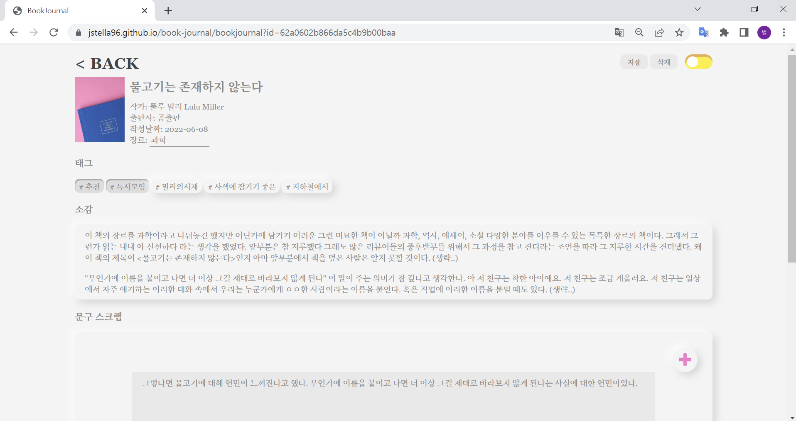
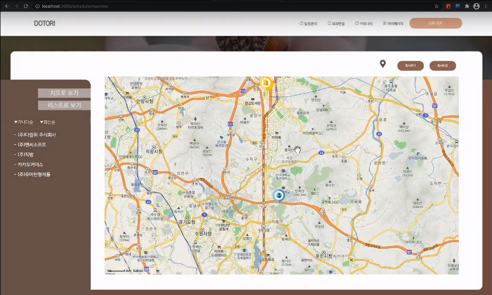
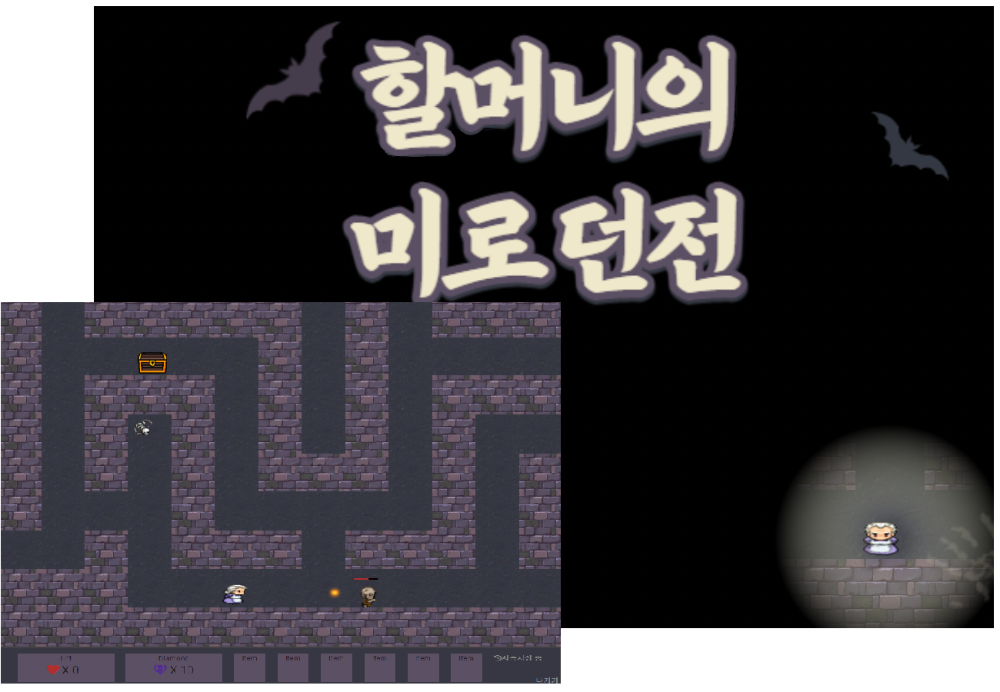
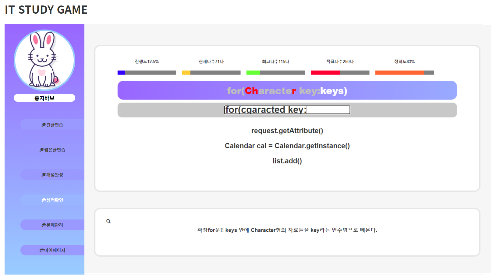
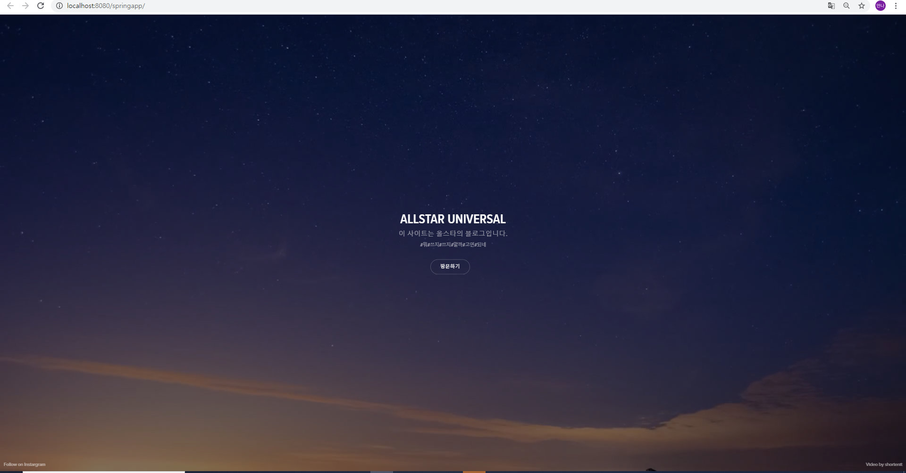
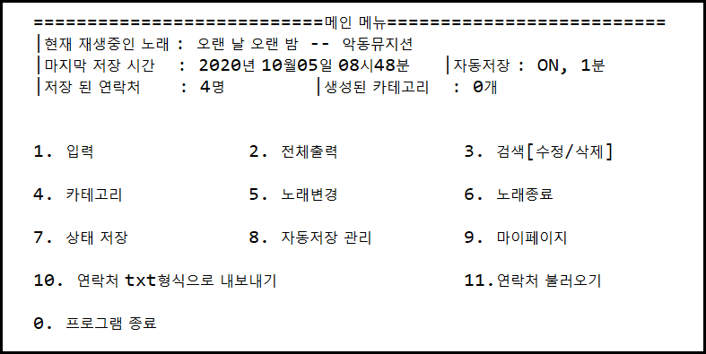

프로젝트를 만들면서 공부하는 것을 좋아합니다.  
개인 공부 시간에 만들었던 소소한 개발 프로젝트를 소개하는 공간입니다.  
공부 목적을 가지고 만들었기 때문에 부족한 점이 많습니다:blush:

## 개발자 0년차 :hatched_chick:

### 프로젝트1 : 바닐라 자바스크립트로 만드는 SPA <Badge text="개발중" type="warning" />

:cupid:**GitHub** : [바로가기 클릭](https://github.com/jstella96/book-journal)  
:computer: **데모 페이지** : [바로가기 클릭](https://jstella96.github.io/book-journal/)

## 예비 개발자 :hatching_chick:

처음 코딩을 배우기 시작할 때 주먹구구로 만들었던 돌아가기만 하는 코드지만 열정으로 코딩하던 시절에 만든 프로젝트예요. 모두에게 공개하기엔 부끄럽긴해도 저에게 개발에 대한 두려움을 없애 주었던 애정 하는 프로젝트들 이랍니다

### 프로젝트1 : 개발자를 위한 취업 플랫폼 DOTORI

:movie_camera:**시연 영상** : [바로가기 클릭](https://www.youtube.com/watch?v=RJfIN3_Uwu0)  
:cupid:**Stack** : React, Spring, Mysql

---

### 프로젝트2 : 2D 던전게임

:movie_camera::**시연 영상** : [바로가기 클릭](https://www.youtube.com/watch?v=S76dEhq3IyE)  
😺**GitHub** : [바로가기 클릭](https://github.com/jstella96/dungeon-game)  
:cupid:**Stack** : Spring, JSP, Mysql

---

### 프로젝트3 : IT STUDY 게임

:movie_camera:**시연 영상** : [바로가기 클릭](https://www.youtube.com/watch?v=S76dEhq3IyE#t=2m17s)  
😺**GitHub** : [바로가기 클릭](https://github.com/jstella96/it-study-game)  
:cupid:**Stack** : Spring, JSP, Mysql

---

### 프로젝트4 : 개인 블로그 AllStar Universal

:movie_camera:**시연 영상** : [바로가기 클릭](https://www.youtube.com/watch?v=cR2xTDW_EFA)  
😺**GitHub** : [바로가기 클릭](https://github.com/jstella96/allstar-universal-blog)  
:cupid:**Stack** : Spring, JSP, Oracle

---

### 프로젝트5 : 주소록 프로젝트

😺**GitHub** : [바로가기 클릭](https://github.com/jstella96/addressbook)  
:cupid:**Stack** : JAVA
